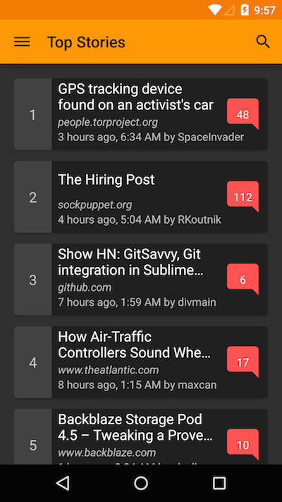
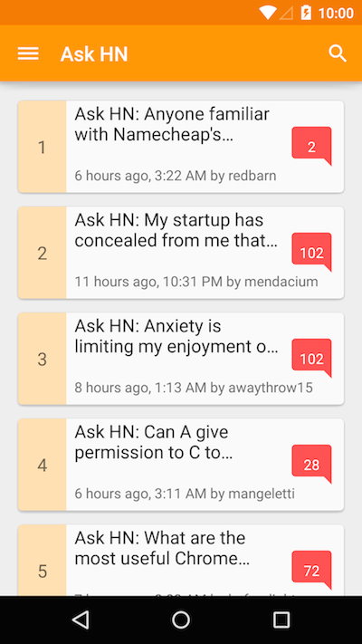

在你的Android App中支持多主题
---

>
* 原文链接 : [Supporting multiple themes in your Android app (Part 1)](http://www.hidroh.com/2015/02/16/support-multiple-themes-android-app/)
* 译者 : [chaossss](https://github.com/chaossss) 
* 校对者: [Mr.Simple](https://github.com/bboyfeiyu)  
* 状态 :  完成





我最近一直在忙着整我的黑客资讯App——Materialistic，今天难得有空，就让我来给大家分享一下我在Materialistic里使用的一个有趣的功能吧。

纵观现在的主流阅读类App，用户最常见的需求就是能够基于自己的阅读习惯选择明亮/灰暗两种风格的主题。为了用户的使用体验，我当然要为Materialistic添加这样的功能啦，要不然没人用我会很伤心的！而且很幸运的是，在Android里支持多种主题的切换并不麻烦（如果你的代码没有问题的话），实现这个功能蛮顺利的。所以今天我打算通过这篇博客给大家介绍我在Materialistic里面为了支持多种主题切换所使用的方法。

准备工作：

1. 你最少要有两个由Android 基本的light/dark主题衍生而来的主题。如果你使用了最新的appcompat-v7包，所对应的就是Theme.AppCompat.Light 或 Theme.AppCompat.Light.DarkActionBar（明亮风格），和Theme.AppCompat（灰暗风格）主题

1. 你需要为你的主题设置颜色。你可以在 [Google design spec](http://www.google.com/design/spec/style/color.html#color-color-palette " Google design spec website") 里面看到有关颜色搭配的指导

1. （可选项）为每一个主题的选项菜单图标加上颜色。取决于你的实现方式，染色过程可以是自动的，也可以是手动的，不过自动化的过程不就意味着你可以把一套图标应用于一种主题嘛，其他的调整只要改改颜色就可以了；但就Materialistic的实际需求来考虑，我还是为一个主题预留了多套不同的图标来避免麻烦……

我今天就以明亮风格的主题来开始讲解吧：

## values/styles.xml ##

```xml
    <style name="AppTheme" parent="Theme.AppCompat.Light">
   		 <item name="colorPrimary">@color/colorPrimary</item>
   		 <item name="colorPrimaryDark">@color/colorPrimaryDark</item>
   		 <item name="colorAccent">@color/colorAccent</item>
   		 <item name="android:textColorPrimary">@color/textColorPrimary</item>
   		 <item name="android:textColorSecondary">@color/textColorSecondary</item>
    	 <item name="android:textColorPrimaryInverse">@color/textColorPrimaryInverse</item>
  	     <item name="android:textColorSecondaryInverse">@color/textColorSecondaryInverse</item>
   		 <!-- some other theme configurations for actionbar, overflow menu etc. -->
   		 ...
    </style>
```

## values/colors.xml ##

```xml
    <!-- brand color: orange -->
    <color name="colorPrimary">#FF9800</color>
    <color name="colorPrimaryDark">#F57C00</color>
    <color name="colorPrimaryLight">#FFE0B2</color>
    <!-- accent color: red -->
    <color name="colorAccent">#FF5252</color>
    <!-- text color: white -->
    <color name="textColorPrimary">#FFFFFF</color>
    <color name="textColorSecondary">#9E9E9E</color>
    <!-- inverse text color: 87% black -->
    <color name="textColorPrimaryInverse">#DE000000</color>
    <color name="textColorSecondaryInverse">#9E9E9E</color>
```

## AndroidManifest.xml ##

```xml
    <application android:name=".Application" android:theme="@style/AppTheme">
    ...
    </application>
```

theme 中涉及的各种属性的含义可以在[Android Developers blog](http://android-developers.blogspot.sg/2014/10/appcompat-v21-material-design-for-pre.html "Android Developers blog") 里面找到解释

## 贴心小提示 ##

> 虽然Android里面style的属性/值非常全面，我们想要实现的效果style基本上都包含了有，但是Android文档有关这些主题属性的解释特别少，尤其是对appcompat的解释。所以我们还是建议你写一个小Demo去测试style里面的属性/值应该怎么使用、能实现什么样的效果，然后再根据我们的需求去考虑使用哪些属性/值来实现我们想要的效果。

根据Android的Material Design规范，选项菜单图标的颜色应该和action bar上面的文字颜色保持一致，在我这是通过 android:textColorPrimary 来实现的，也就是使用#FFFFFF，基于这样的规范，我们需要为action bar提供一套白色的选项菜单图标。

## 贴心小提示 ##

> Google 有在 [material-design-icons - Github](https://github.com/google/material-design-icons "Github") 上提供一些开源的Material Design图标哦。

## menu/my_menu.xml ##

```xml
    <menu xmlns:android="http://schemas.android.com/apk/res/android">
    	<item android:id="@id/menu_comment"
    android:icon="@drawable/ic_mode_comment_white_24dp" />
    	<item android:id="@id/menu_story"
    android:icon="@drawable/ic_subject_white_24dp" />
    	<item android:id="@id/menu_share"
    app:actionProviderClass="android.support.v7.widget.ShareActionProvider" />
    </menu>
```

为了使颜色一致，并且能让我们的Views和Texts能够在多个主题下被使用，最好的解决办法就是把颜色变成资源的引用，例如：android:textColor="@color/textColorPrimary；又或者是通过设置style来改变，例如：在textEmptyStyle.xml文件下，我们只使用被选中的颜色

## values/styles.xml ##

```xml
    <style name="textEmptyStyle">
   		 <item name="android:textColor">@color/textColorSecondary</item>
   		 <item name="android:textSize">@dimen/abc_text_size_headline_material</item>
    ...
    </style>
```

我相信通过今天在上面所介绍的这些内容已经足够让我们实现一个符合Material Design的明亮风格的主题了，下一篇博文我将会给大家介绍如何实现一个符合Material Design的灰暗风格的主题，以及如何在运行App的过程中切换主题。希望大家继续关注我的博客哦。
