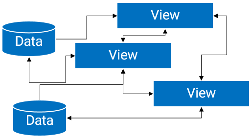

MVP在Android平台上的应用
---

> * 原文链接 : [Introduction to Model-View-Presenter on Android](http://konmik.github.io/introduction-to-model-view-presenter-on-android.html)
* 原文作者 : [konmik](http://konmik.github.io/)
* 译文出自 : [  其他  http://konmik.github.io/introduction-to-model-view-presenter-on-android.html](http://konmik.github.io/introduction-to-model-view-presenter-on-android.html)
* 译者 : [MiJack](https://github.com/MiJack)  
* 校对者: 
* 状态 : 翻译完成


#Introduction to Model-View-Presenter on Android

#Android平台上MVP的介绍

This article is a step-by-step introduction to MVP on Android, from a simplest possible example to best practices. The article also introduces a new library that makes MVP on Android extremely simple.

这篇文章向你介绍Android平台上的MVP模式，从一个简浅的例子开始实践之路。文章也会介绍一个一个库让你在Android平台上轻松的实现MVP

##Is it simple? How can I benefit of using it?

##简单吗？我怎么才能从中受益？

###What is MVP

###什么是MVP？


- **View** is a layer that displays data and reacts to user actions. On Android, this could be an Activity, a Fragment, an android.view.View or a Dialog.
- **Model** is a data access layer such as database API or remote server API.
- **Presenter** is a layer that provides View with data from Model. Presenter also handles background tasks.

- **View**层主要是用于展示数据并对用户行为做出反馈。在Android平台上，他可以对应为Activity, Fragment,View或者对话框。
- **Model**是数据访问层，往往是数据库接口或者服务器的API。
- **Presenter**层可以想View层提供来自数据访问层的数据，除此以外，他也会处理一些后台事务。

On Android，MVP is a way to separate background tasks from activities/views/fragments to make them independent of most lifecycle-related events. This way an application becomes simpler, overall application reliability increases up to 10 times, application code becomes shorter, code maintainability becomes better and developer's life becomes happier.

在Android平台上，MVP可以将后台事务从Activity/View/Fragment中分离出来，让它们独立于大部分生命周期事件。这样，一个应用将会变得简单， 整个应用可靠性可以提高10倍，应用的代码将会变短, 代码的可维护性提高，开发者也为此感到高兴。

###Why MVP on Android

###Android为什么需要MVP

####Reason 1: Keep It Stupid Simple

####理由1：尽量简单
If you haven't read this article yet, do [it](https://people.apache.org/~fhanik/kiss.html): The Kiss Principle

如果你还有读过这篇文章，请阅读它：[Kiss原则](https://people.apache.org/~fhanik/kiss.html)（Keep It Stupid Simple）

- Most of the modern Android applications just use View-Model architecture.
- Programmers are involved into fight with View complexities instead of solving business tasks.

- 大部分的安卓应用只使用View-Model结构
- 程序员现在更多的是和复杂的View打交道而不是解决业务逻辑。

Using only Model-View in your application you usually end up with "everything is connected with everything".

当你在应用中只使用Model-View时，到最后，你会发现“所有的事物都被连接到一起”。


If this diagram does not look complex, then think about each View can disappear and appear at random time. Do not forget about saving/restoring of Views. Attach a couple of background tasks to that temporary Views, and the cake is ready!

如果这张图看上去还不是很复杂，那么请你想象一下以下情况：每一个View在任意一个时刻都有可能出现或者消失。不要忘记View的保存和恢复，在临时的view上挂载一个后台任务。

An alternative to the "everything is connected with everything" is a god object.
“所有的事物都被连接到一起”的替代品是一个万能对象(god object)。


A god object is overcomplicated; its parts cannot be reused, tested or easily debugged and refactored.

god object是十分复杂的，他的每一个部分都不能重复利用，无法轻易的测试、或者调试和重构。

###With MVP

###使用MVP


Complex tasks are split into simpler tasks and are easier to solve.
Smaller objects, less bugs, easier to debug.
Testable.
View layer with MVP becomes so simple, so it does not even need to have callbacks when requesting for data. View logic becomes very linear.

复杂的任务被分成细小的任务，并且很容易解决。越小的东西，bug越少，越容易debug，更好测试。在MVP模式下的View层将会变得简单，所以即便是他请求数据的时候也不需要回调函数。View逻辑变成十分直接。

Reason 2: Background tasks

理由2：后台任务

Whenever you write an Activity, a Fragment or a custom View, you can put all methods that are connected with background tasks to a different external or static class. This way your background tasks will not be connected with an Activity, will not leak memory and will not depend on Activity's recreation. We call such object "Presenter".

当你编写一个Actviity、Fragment、自定义View的时候，你会把所有的和后台任务相关的方法写在一个静态类或者外部类中。这样，你的Task不再和Activity联系在一起，这既不会导致内存泄露，也不依赖于Activity的重建。

There are few different approaches to handle background tasks but non of them are as reliable as MVP is.

这里有若干种方法处理后台任务，但是它们的可靠性都不及MVP。

Why this works

为什么它是可行的？

Here is a little diagram that shows what happens with different application parts during a configuration change or during an out-of-memory event. Every Android developer should know this data, however this data is surprisingly hard to find.

这里有一张表格，用于展示在configuration改变、Activity 重启、Out-Of-Memory时，不同的应用部分会发生什么？

|    |    Case 1     |     Case 2     |    Case 3|
|:-------------:|:-------------:|:-------------:|:-------------:|
||A configuration change| An activity  restart|  A process restart|
 |Dialog                   |     reset     |    reset     |    reset|
|Activity, View, Fragment  | save/restore  | save/restore | save/restore|
| Fragment with setRetainInstance(true)  |no change | save/restore | save/restore|
| Static variables and threads  |   no change   |   no change  |    reset|
 
|    |    情景 1     |     情景 2     |    情景 3|
|:-------------:|:-------------:|:-------------:|:-------------:|
||配置改变| Activity 重启|  进程重启|
 |对话框                   |     重置     |    重置     |    重置|
|Activity, View, Fragment  | 保存/恢复  | 保存/恢复 | 保存/恢复|
| Fragment with setRetainInstance(true)  |无变化 | 保存/恢复 | 保存/恢复|
| Static variables and threads  |  无变化 |  无变化  |    重置|

Case 1: A configuration change normally happens when a user flips the screen, changes language settings, attaches an external monitor, etc. More on this event you can read here: configChanges.

Case 2: An Activity restart happens when a user has set "Don't keep activities" checkbox in Developer's settings and another activity becomes topmost.

Case 3: A process restart happens if there is not enough memory and the application is in the background.


情景 1: 当用户切换屏幕、更改语言设置或者链接外部的模拟器时，往往意味着设置改变。 相关更多请阅读[这里](http://developer.android.com/reference/android/R.attr.html#configChanges)。

情景 2:Activity的重启发生在当用户在开发者选项中选中了“Don't keep activities”（“中文下为 不保留活动”）的复选框，然后另一个Activity在最顶上的时候。

情景 3: 进程的重启发生在应用运行在后台，但是这个时候内存不够的情况下。


###Conclusion

###总结

Now you can see, a Fragment with setRetainInstance(true) does not help here - we need to save/restore such fragment's state anyway. So we can simply throw away retained fragments to limit the number of problems. Occam's razor.

现在你可以发现，一个调用了setRetainInstance(true)的Fragment也不奏效，我们还是需要保存/恢复fragment的状态，所以为简化问题，我们暂不考虑上述情况的Fragment。[Occam's razor](http://en.wikipedia.org/wiki/Occam's_razor)

|       |A configuration  change,   An activity  restart  |   A process    restart|
|:-------------:|:-------------:|:-------------:|
 |Activity, View, Fragment, DialogFragment | save/restore  | save/restore|
|Static variables and threads             |   no change   |    reset|


|       |配置改变,   Activity重启  |  进程重启|
|:-------------:|:-------------:|:-------------:|
 |Activity, View, Fragment, DialogFragment | 保存/恢复  |保存/恢复  |
|Static variables and threads             |   无变化   |   重置|


Now it looks much better. We only need to write two pieces of code to completely restore an application in any possible case:

现在，看上去更舒服了，我们只需要写两段代码为了恢复应用：

* save/restore for Activity, View, Fragment, DialogFragment;

* restart background requests in case of a process restart.

* 保存/恢复 for Activity, View, Fragment, DialogFragment;

* 重启后台请求由于进程重启

The first part can done by usual means of Android API. The second part is a job for Presenter. Presenter just remembers which requests it should execute, and if a process restarts during execution, Presenter will execute them again.


第一个部分,用Android的API可以实现。第二个部分，就是Presenter的作用了。Presenter将会记住有哪些请求需要执行，当进程在执行过程中重启时，Presenter将会出现执行它们。

#####A simple example (no MVP)


#####一个简单的例子(no MVP)

This example will load and display some items from remote server. If an error occurs a little toast will be shown.

这个例子用于从远程服务器加载数据并呈现，当发生异常时，会通过Toast提示。

I recommend [RxJava](https://github.com/ReactiveX/RxJava) usage to build presenters because this library allows to control data flows easily.

我推荐使用[RxJava](https://github.com/ReactiveX/RxJava)构建Presenter，因为这个库更容易控制数据流。

I would like to thank the guy who created a simple api that I use for my examples: [The Internet Chuck Norris Database](http://www.icndb.com/)

我想对创造如此简单的API的伙计说声谢谢，我把它用于[The Internet Chuck Norris Database](http://www.icndb.com/)

Without MVP [example 00](https://github.com/konmik/MVPExamples/tree/master/example00):

无MVP的[例子00](https://github.com/konmik/MVPExamples/tree/master/example00)：

```java

public class MainActivity extends Activity {
    public static final String DEFAULT_NAME = "Chuck Norris";

    private ArrayAdapter<ServerAPI.Item> adapter;
    private Subscription subscription;

    @Override
    public void onCreate(Bundle savedInstanceState) {
        super.onCreate(savedInstanceState);
        setContentView(R.layout.activity_main);
        ListView listView = (ListView)findViewById(R.id.listView);
        listView.setAdapter(adapter = new ArrayAdapter<>(this, R.layout.item));
        requestItems(DEFAULT_NAME);
    }

    @Override
    protected void onDestroy() {
        super.onDestroy();
        unsubscribe();
    }

    public void requestItems(String name) {
        unsubscribe();
        subscription = App.getServerAPI()
            .getItems(name.split("\\s+")[0], name.split("\\s+")[1])
            .delay(1, TimeUnit.SECONDS)
            .observeOn(AndroidSchedulers.mainThread())
            .subscribe(new Action1<ServerAPI.Response>() {
                @Override
                public void call(ServerAPI.Response response) {
                    onItemsNext(response.items);
                }
            }, new Action1<Throwable>() {
                @Override
                public void call(Throwable error) {
                    onItemsError(error);
                }
            });
    }

    public void onItemsNext(ServerAPI.Item[] items) {
        adapter.clear();
        adapter.addAll(items);
    }

    public void onItemsError(Throwable throwable) {
        Toast.makeText(this, throwable.getMessage(), Toast.LENGTH_LONG).show();
    }

    private void unsubscribe() {
        if (subscription != null) {
            subscription.unsubscribe();
            subscription = null;
        }
    }
}

```

An experienced developer will notice that this simple example has some critical defects in it:

有经验的开发者会注意到这个例子有以下不妥：


A request starts every time a user flips the screen - an app makes more requests than needed and the user observes an empty screen for a moment after each screen flip.

当用户翻转屏幕时候会开始请求，应用发起了过多的请求，将会是屏幕在切换的时候呈现空白的界面。

If a user flips the screen often this will cause memory leaks - every callback keeps a reference to MainActivity and will keep it in memory while a request is running. It is absolutely possible to get an application crash because of out-of-memory error or a significant application slowdown.


当用户频繁的切换屏幕，这将会造成内存泄露，请求运行时，每一个回调将会持有MainActivity的引用，让其保存在内存中。因此引起的OOM和应用反应迟缓，会引发应用的Crash。


With MVP [example 01](https://github.com/konmik/MVPExamples/tree/master/example01):

MVP模式下的[例子 01](https://github.com/konmik/MVPExamples/tree/master/example01)

```java
public class MainPresenter {

    public static final String DEFAULT_NAME = "Chuck Norris";

    private ServerAPI.Item[] items;
    private Throwable error;

    private MainActivity view;

    public MainPresenter() {
        App.getServerAPI()
            .getItems(DEFAULT_NAME.split("\\s+")[0], DEFAULT_NAME.split("\\s+")[1])
            .delay(1, TimeUnit.SECONDS)
            .observeOn(AndroidSchedulers.mainThread())
            .subscribe(new Action1<ServerAPI.Response>() {
                @Override
                public void call(ServerAPI.Response response) {
                    items = response.items;
                    publish();
                }
            }, new Action1<Throwable>() {
                @Override
                public void call(Throwable throwable) {
                    error = throwable;
                    publish();
                }
            });
    }

    public void onTakeView(MainActivity view) {
        this.view = view;
        publish();
    }

    private void publish() {
        if (view != null) {
            if (items != null)
                view.onItemsNext(items);
            else if (error != null)
                view.onItemsError(error);
        }
    }
}

```

Technically speaking, MainPresenter has three threads of events: *onNext*, *onError*, *onTakeView*. They join in `publish()` method and *onNext* or *onError* values become published to a MainActivity instance that has been supplied with onTakeView.

从严格意义上来说，MainPresenter有三个事件处理线程： *onNext*, *onError*, *onTakeView*。他们调用了`publish()`方法，*onNext* 或 *onError*的值将会在MainActivity中发布，而不是由onTakeView提供。 	 


```java
public class MainActivity extends Activity {

    private ArrayAdapter<ServerAPI.Item> adapter;

    private static MainPresenter presenter;

    @Override
    public void onCreate(Bundle savedInstanceState) {
        super.onCreate(savedInstanceState);
        setContentView(R.layout.activity_main);

        ListView listView = (ListView)findViewById(R.id.listView);
        listView.setAdapter(adapter = new ArrayAdapter<>(this, R.layout.item));

        if (presenter == null)
            presenter = new MainPresenter();
        presenter.onTakeView(this);
    }

    @Override
    protected void onDestroy() {
        super.onDestroy();
        presenter.onTakeView(null);
        if (isFinishing())
            presenter = null;
    }

    public void onItemsNext(ServerAPI.Item[] items) {
        adapter.clear();
        adapter.addAll(items);
    }

    public void onItemsError(Throwable throwable) {
        Toast.makeText(this, throwable.getMessage(), Toast.LENGTH_LONG).show();
    }
}
```
MainActivity creates MainPresenter and keeps it outside of reach of onCreate/onDestroy cycle. MainActivity uses a static variable to reference MainPresenter, so every time a process restarts due to out-of-memory event, MainActivity should check if the presenter is still here and create it if needed.
 
MainActivty构建了MainPresenter，将其维持在onCreate/onDestroy周期外，MainActivity持有MainPresenter的静态引用，所以每一个进程由于OOM重启时，MainActivity可以确认Presenter是否仍然存在，必要时创建。

Yes, this looks a little bit bloated with checks and uses a static variable, but later I will show how to make this look much better. :)

当然，确认和使用静态变量可能是代码变得臃肿，稍后我们会告诉你如何好看些：。:)

The main idea is:

重要思路：

* The example application does not start a request every time a user flips the screen.
* If a process has been restarted the example loads data again.
* MainPresenter does not keep a reference to a MainActivity instance while MainActivity is destroyed, so there is no memory leak on a screen flip, and there is no need to unsubscribe the request.

* 示例程序不会在每次切换屏幕的时候都开始一个新的请求
* 当进程重启时，示例程序将会重新加载数据。
* 当MainActivity销毁时，MainPresenter不会持有MainActivity的引用，因此不会在切换屏幕的时候发生内存泄漏，而且没必要去unsubscribe请求。

###[Nucleus](https://github.com/konmik/nucleus)

Nucleus is a library I created while was inspired by [Mortar](https://github.com/square/mortar) library and Keep It Stupid Simple article.

Nucleus是我从[Mortar](https://github.com/square/mortar)和 Keep It Stupid Simple 这篇文章得到的灵感而建立的库。

Here is a list of features:

它有以下特征：

* It supports save/restore Presenter's state in a View/Fragment/Activity's state Bundle. A Presenter can save request arguments into that bundles to restart them later.

* 它支持在View/Fragment/Activity的Bundle中保存/恢复Presenter的状态，一个Presenter可以保存请求参数，以便之后重启它们
 
* It provides a facility to direct request results and errors right into a view with just one line of code, so you don't have to write all that `!= null` checks.

* 只需要一行代码，它就可以直接将请求结果或者错误反馈给View，所以你不需要写`!= null`之类的核对代码。
 
* It allows you to have more than one instance of a view that requires a presenter. You can't do this if you're instantiating a presenter with [Dagger](http://square.github.io/dagger/) (a traditional way).

* 它允许你可以有多个持有Presenter的实例。 不过你不能在用[Dagger](http://square.github.io/dagger/)实例化的presenter中这样使用(传统方法).

* It provides a shortcut for binding a presenter to a view with just one line.

* 它可以用一行代码快速的将View和Presenter绑定。

* It provides base View classes: `NucleusView`, `NucleusFragment`, `NucleusSupportFragment`, `NucleusActivity`. You can also copy/paste code from one of them to make any class you use to utilize presenters of Nucleus.

* 它提供一些现成的基类，例如: `NucleusView`, `NucleusFragment`, `NucleusSupportFragment`, `NucleusActivity`. 你可以将他们的代码拷贝出来改造出一个自己的类以利用Nucleus的presenter。

* It can automatically restart requests after a process restart and automatically unsubscribe RxJava subscriptions during `onDestroy`.

* 支持在进程重启后，自动重新发起请求，在`onDestroy`方法中，自动的退订RxJava的订阅。

* And finally, it is plain simple, so any developer can understand it. There are just about 180 lines of code to drive Presenter and 230 lines of code for RxJava support.

* 最后，它简洁明了，每一个开发者都会理解，Presenter的驱动只用了180行代码，RxJava用了230行代码。

Example with [Nucleus](https://github.com/konmik/nucleus) [example 02](https://github.com/konmik/MVPExamples/tree/master/example02)


使用了[Nucleus](https://github.com/konmik/nucleus) 的[例 02](https://github.com/konmik/MVPExamples/tree/master/example02)

```java
public class MainPresenter extends RxPresenter<MainActivity> {

    public static final String DEFAULT_NAME = "Chuck Norris";

    @Override
    protected void onCreate(Bundle savedState) {
        super.onCreate(savedState);

        App.getServerAPI()
            .getItems(DEFAULT_NAME.split("\\s+")[0], DEFAULT_NAME.split("\\s+")[1])
            .delay(1, TimeUnit.SECONDS)
            .observeOn(AndroidSchedulers.mainThread())
            .compose(this.<ServerAPI.Response>deliverLatestCache())
            .subscribe(new Action1<ServerAPI.Response>() {
                @Override
                public void call(ServerAPI.Response response) {
                    getView().onItemsNext(response.items);
                }
            }, new Action1<Throwable>() {
                @Override
                public void call(Throwable throwable) {
                    getView().onItemsError(throwable);
                }
            });
    }
}

@RequiresPresenter(MainPresenter.class)
public class MainActivity extends NucleusActivity<MainPresenter> {

    private ArrayAdapter<ServerAPI.Item> adapter;

    @Override
    public void onCreate(Bundle savedInstanceState) {
        super.onCreate(savedInstanceState);
        setContentView(R.layout.activity_main);

        ListView listView = (ListView)findViewById(R.id.listView);
        listView.setAdapter(adapter = new ArrayAdapter<>(this, R.layout.item));
    }

    public void onItemsNext(ServerAPI.Item[] items) {
        adapter.clear();
        adapter.addAll(items);
    }

    public void onItemsError(Throwable throwable) {
        Toast.makeText(this, throwable.getMessage(), Toast.LENGTH_LONG).show();
    }
}
```
As you can see, this example is significantly shorter and cleaner than the previous one. Nucleus creates/destroys/saves presenter, attaches/detaches a View to it and sends request results right into an attached view automatically.

正如你看到的，跟上一个代码相比，这个例子十分简洁。Nucleus 可以构造/销毁/变成 Presenter, 向Presenter中添加/分离 View ，并且自动向附加的view发送请求。。

`MainPresenter`'s code is shorter because it uses `deliverLatestCache()` operation that delays all data and errors that has been emitted by a data source until a view becomes available. It also caches data in memory so it can be reused on configuration change.

`MainPresenter`的代码比较短，因为它使用`deliverLatestCache（）`的操作，延迟了由一个数据源发出所有的数据和错误，直到View可用。它还把数据缓存在内存中，以便它可以在Configuration change时可以被重用。

`MainActivity`'s code is shorter because presenter's creation is managed by `NucleusActivity`. All you need to bind a presenter is to write `@RequiresPresenter(MainPresenter.class)` annotation.

`MainActivity`的代码比较短，因为主Presenter的创作由`NucleusActivity`管理。当你需要绑定一个Presenter的时候，只需要添加注解`@RequiresPresenter（MainPresenter.class）`。

Warning! An annotation! In Android world, if you use annotations, it is a good practice to check that this will not degrade performance. The benchmark I've made on `Galaxy S` (year 2010 device) says that processing this annotation takes less that 0.3 ms. This happens only during instantiation of a view, so the annotation is considered to be free.

警告！注释！在Android中，如果你使用注解，这是最好检查以下这么做会不会降低性能。以我使用的'Galaxy S`（2010年设备）为例，处理此批注耗时不超过0.3毫秒。只在实例化view的时候才会发生，因此注解在这里对性能的影响可以忽略。

####More examples

####更多例子

An extended example with request arguments persistence is here: [Nucleus Example](https://github.com/konmik/nucleus/tree/master/nucleus-example).

一个扩展的例子,带有请求参数的Presenter：[Nucleus Example](https://github.com/konmik/nucleus/tree/master/nucleus-example)。

An example with unit tests: [Nucleus Example With Tests](https://github.com/konmik/nucleus/tree/master/nucleus-example-with-tests)

带有单元测试的例子： [Nucleus Example With Tests](https://github.com/konmik/nucleus/tree/master/nucleus-example-with-tests)

####`deliverLatestCache()` method
####`deliverLatestCache()` 方法

This RxPresenter helping method has three variants:

* `deliver()` will just delay all onNext, onError and onComplete emissions until a View becomes available. Use it for cases when you're doing a one-time request, like logging in to a web service. [Javadoc](http://konmik.github.io/nucleus/nucleus/presenter/Presenter.html#onCreate(android.os.Bundle))

* `deliver()`只是推迟onNext、onError、onComplete的调用，直到视图有效。使用它，你只需要一次请求，就像发起登陆web服务一样。[Javadoc](http://konmik.github.io/nucleus/nucleus/presenter/Presenter.html#onCreate(android.os.Bundle))

* `deliverLatest()` will drop the older onNext value if a new onNext value is available. If you have an updatable source of data this will allow you to not accumulate data that is not necessary. [Javadoc](http://konmik.github.io/nucleus/nucleus/presenter/RxPresenter.html#deliverLatest)
* `deliverLatest（）`当有新的的onNext值，将会舍弃原有的值，如果你有可更新的数据源，这将让你去除那些不需要的数据。[Javadoc](http://konmik.github.io/nucleus/nucleus/presenter/RxPresenter.html#deliverLatest)

* `deliverLatestCache()` is the same as `deliverLatest()` but in addition it will keep the latest result in memory and will re-deliver it when another instance of a view becomes available (i.e. on configuration change). If you don't want to organize save/restore of a request result in your view (in case if a result is big or it can not be easily saved into Bundle) this method will allow you to make user experience better. [Javadoc](http://konmik.github.io/nucleus/nucleus/presenter/RxPresenter.html#deliverLatestCache)

* `deliverLatestCache（）`，和`deliverLatest（）`一样，但除了它会在内存中保存最新的结果外，当View的另一个实例可用（例如：在配置更改的时候）时，还是会触发一次。如果你不想组织请求在你的View中的保存/恢复事务（比方说，结果太大或者不能很容易地保存在Bundle中），这个方法可以让用户体验更好。[Javadoc](http://konmik.github.io/nucleus/nucleus/presenter/RxPresenter.html#deliverLatestCache)


####Presenter's lifecycle

####Presenter的生命周期

Presenter's lifecycle is significantly shorter that a lifecycle of other Android components.

相比Android组件，Presenter的生命周期更加简短。

* `void onCreate(Bundle savedState)` - is called on every presenter's creation.  [Javadoc](http://konmik.github.io/nucleus/nucleus/presenter/Presenter.html#onCreate(android.os.Bundle))

* `void onCreate(Bundle savedState)` - 每一个Presenter构造时 .  [Javadoc](http://konmik.github.io/nucleus/nucleus/presenter/Presenter.html#onCreate(android.os.Bundle))

* `void onDestroy()` - is called when user leaves a View. [Javadoc](http://konmik.github.io/nucleus/nucleus/presenter/Presenter.html#onDestroy())

* `void onDestroy()` - 用户离开View时调用 . [Javadoc](http://konmik.github.io/nucleus/nucleus/presenter/Presenter.html#onDestroy())

* `void onSave(Bundle state)` - is called during View's `onSaveInstanceState` to persist Presenter's state as well.  [Javadoc](http://konmik.github.io/nucleus/nucleus/presenter/Presenter.html#onSave(android.os.Bundle))

* `void onSave(Bundle state)` - 在View的`onSaveInstanceState`方法中调用，用于持有Presenter的状态.  [Javadoc](http://konmik.github.io/nucleus/nucleus/presenter/Presenter.html#onSave(android.os.Bundle))

* `void onTakeView(ViewType view)` - 在Activity或者Fragment的`onResume()`方法中或者`android.view.View#onAttachedToWindow()`调用.  [Javadoc](http://konmik.github.io/nucleus/nucleus/presenter/Presenter.html#onTakeView(ViewType))

* `void onTakeView(ViewType view)` - is called during Activity's or Fragment's `onResume()`, or during `android.view.View#onAttachedToWindow()`.  [Javadoc](http://konmik.github.io/nucleus/nucleus/presenter/Presenter.html#onTakeView(ViewType))

* `void onTakeView(ViewType view)` - 在Activity或者Fragment的`onResume()`方法中或者`android.view.View#onAttachedToWindow()`调用.  [Javadoc](http://konmik.github.io/nucleus/nucleus/presenter/Presenter.html#onTakeView(ViewType))

* `void onDropView()` - is called during Activity's or Fragment's `onPause()`, or during `android.view.View#onDetachedFromWindow()`.  [Javadoc](http://konmik.github.io/nucleus/nucleus/presenter/Presenter.html#onDropView)

* `void onDropView()` -  在Activity或者Fragment的`onPause()`方法中或者`android.view.View#onDetachedFromWindow()`调用. [Javadoc](http://konmik.github.io/nucleus/nucleus/presenter/Presenter.html#onDropView)

####View recycling and view stack
####View的回收与View栈

Normally your views (i.e. fragments and custom views) are attached and detached randomly during user interactions. This could be a good idea to not destroy a presenter every time a view is detached. You can detach and attach views any time and presenters will outlive all this actions, continuing background work.

通常来说,你的view（比如fragment或者自定义的view）在用户的交互过程中挂载与解挂（attached and detached）都是随机发生的。 这倒是不让presenter在view每次解挂（detached）的时候都销毁的一个启发。你可以在任何时候挂载与解挂view，但是presenter可以在这些行为中幸存下来，继续后台的工作。

There is a problem that is connected to view resycling: a fragment can not know if it is detached because of configuration change or because it is being popped off the stack.

这里还存在着一个关于View回收的问题：一个Fragment在Configuration change或者从stack中弹出的情况下，不知道自身有没有解挂（detached）。

The default behavior of Nucleus views is: destroy a presenter during view's `onDetachedFromWindow()`/`onDestroy()` only if the activity is finishing.

默认只在Activity处于finish时，才在调用View的`onDetachedFromWindow()`/`onDestroy()` 销毁Presenter。

So, if you're destroying a view during normal Activity life, you need to signal to that view that it's presenter should also be destroyed. There are public `NucleusLayout.destroyPresenter()` and `NucleusFragment.destroyPresenter()` methods that can be used here.

所以，当你在常规的Activity生命周期内，销毁View，你需要给给View一个销毁Presenter的信号。在这里，公有方法`NucleusLayout.destroyPresenter()` and `NucleusFragment.destroyPresenter()`就派上用场了。

For example, here is how fragment manager's `pop()` operation works in one of my projects:

例如，在我的项目中，下面的是我如何进行FragmentManager的`pop()`操作:

```java
    fragment = fragmentManager.findFragmentById(R.id.fragmentStackContainer);
    fragmentManager.popBackStackImmediate();
    if (fragment instanceof NucleusFragment)
        ((NucleusFragment)fragment).destroyPresenter();
```

You will need to do the same for *replace* fragment stack operation, and probably for *push* operation when your bottom fragment gets destroyed.

在进行*replace*Fragment栈和对处于底部的Fragment进行*push*操作时，你可能需要进行相同的操作。

You may decide to destroy presenters every time views get detached from their Activity and avoid such problems, but you will lose an ability to continue background tasks while views are detached.

在View从Activity解挂（detached）时，您可能会选择摧毁Presenter来避免问题的发生，但是，这将意味着当View解挂（detached）时，后台任务无法继续进行。

So, this "view recycling" section is left entirely up to you. Probably, I will find an elegant solution for this problem, but if you know one, please let me know.

所以这一节的 "view recycling"完全留你你自己考虑，也许有一天我会找到更好的解决办法，如果你有一个办法，请告诉我。
####Best practices

####最佳实践

Save your request arguments inside Presenter

在Presenter中保存你的请求参数。

The rule is simple: the presenter's main purpose is to manage requests. So View should not handle or restart requests itself. From a View's perspective, background tasks are something that never disappear and will always return a result or an error *without any callbacks*.


规则很简单：Presenter的主要作用是管理请求。所以，View不应该自己处理或者重启请求。从View中，我们可以看见，后台事务不会消失，总是会返回结果或者错误，*而不是通过回调的方式*。


```java

public class MainPresenter extends RxPresenter<MainActivity> {

    private String name = DEFAULT_NAME;

    @Override
    protected void onCreate(Bundle savedState) {
        super.onCreate(savedState);
        if (savedState != null)
            name = savedState.getString(NAME_KEY);
        ...

    @Override
    protected void onSave(@NonNull Bundle state) {
        super.onSave(state);
        state.putString(NAME_KEY, name);
    }
}
```

I recommend using awesome [Icepick](https://github.com/frankiesardo/icepick) library. It reduces code size and simplifies application logic without using runtime annotations - everything happens during compilation. This library is a good partner for [ButterKnife](http://jakewharton.github.io/butterknife).

我推荐使用一个很棒的库[Icepick](https://github.com/frankiesardo/icepick)。在不使用运行时注解的前提下，它可以减少代码量，并简化应用程序逻辑 - 所有的事都在编译过程中已经处理好了。这个库和[ButterKnife](http://jakewharton.github.io/butterknife)搭配是个不错的选择。

 
```java
public class MainPresenter extends RxPresenter<MainActivity> {

    @Icicle String name = DEFAULT_NAME;

    @Override
    protected void onCreate(Bundle savedState) {
        super.onCreate(savedState);
        Icepick.restoreInstanceState(this, savedState);
        ...
    }
    @Override
    protected void onSave(@NonNull Bundle state) {
        super.onSave(state);
        Icepick.saveInstanceState(this, state);
    }
}
 
```
If you have more than a couple of request arguments this library naturally saves life. You can create `BasePresenter` and put *Icepick* into that class once and all subclasses will automatically get the ability to save their fields that are annotated with `@Icicle` and you will never need to implement `onSave` again. This also works for saving Activity's, Fragment's or View's state.

如果你有不止一对请求参数，这个库在不使用运行时注解的前提下。您可以创建`BasePresenter`并把*Icepick*到该类中，所有的子类将会自动保存标有`@Icicle`这一注解的变量，而你将不再需要去实现`OnSave`。这也适用于保存Activity，Fragment，View的状态。

####Execute instant queries on the main thread in `onTakeView` [Javadoc](http://konmik.github.io/nucleus/nucleus/presenter/Presenter.html#onTakeView(ViewType))

####在主线程中调用`onTakeView`进行即时查询[Javadoc](http://konmik.github.io/nucleus/nucleus/presenter/Presenter.html#onTakeView(ViewType))

Sometimes you have a short data query, such as reading a small amount of data from a database. While you can easily create a restartable request with Nucleus, you don't have to use this powerful tool everywhere. If you're initiating a background request during a fragment's creation, a user will see a blank screen for a moment, even if the query will take just a couple of milliseconds. So, to make code shorter and users happier, use the main thread.

有时候，你要进行少量的数据查询，如从数据库中读取少量的数据。虽然你可以很容易地用Nucleus创建一个可重启的请求，你不必到处使用这个强大的工具。如果你在fragment创建的时候初始化一个后台请求，即使只有几毫秒，用户也会看到一会儿的空白屏。因此，为了使代码更短，用户体验更好，可以使用主线程。

####Do not try to make your Presenter control your View

#### 不要让Presenter控制你的View

This does not work well - the application logic becomes too complex because it goes in an unnatural way.

这不是很好的工作方式 - 由于这种不自然的方式，应用程序逻辑变得太复杂。

The natural way is to make a flow of control to go from a user, through view, presenter and model to data. In the end a user will use the application and the user is a source of control for the application. So control should go from a user rather than from a some internal application structure.

自然的方式是操作流由用户发起，通过View，Presenter和Model，最后流向数据。毕竟，用户将使用应用,用户是控制应用程序的源头。因此，控制应该从用户开始而不是一些应用的内部结构。

When control goes from View to Presenter and then from Presenter to Model it is just a direct flow, it is easy to write code like this. You get an easy __user -> view -> presenter -> model -> data__ sequence. But when control goes like this: __user -> view -> presenter -> view -> presenter -> model -> data__, it is just violates KISS principle.


从view，到presenter到model是很直接的形式，很容易书写这样的代码。你将得到以下序列： __user -> view -> presenter -> model -> data__ 。但是，当控制流变成这样时: __user -> view -> presenter -> view -> presenter -> model -> data__，它只是违反KISS原则.


Fragments? Yes, they are something that violates this natural flow of control. They are too complex. Here is a very good article considering fragments: [Advocating Against Android Fragments](http://corner.squareup.com/2014/10/advocating-against-android-fragments.html). But the alternative [Flow](https://github.com/square/flow) does not simplify things much.

Fragments？不好意思它是违背了这种自然操作流程的。它们太复杂。这里是一个非常好讲诉Fragment的文章：[抨击Android的Fragment](http://corner.squareup.com/2014/10/advocating-against-android-fragments.html)。fragment的替代者[Flow](https://github.com/square/flow) 并没有简化多少东西。

####MVC

If you're familiar with MVC (Model-View-Controller) - don't do that. Model-View-Controller is absolutely different from MVP and does not solve any problems which interface developers are facing.

如果你对MVC（模型-View-控制器）-不要去使用。模型-View-控制器和MVP完全不同，不能解决接口开发者面对的问题。

####What is MVC?

####什么是MVC?


* **Model** stands here for internal application state. It can or can not be connected with a storage.
* **View** is the only thing that is partially common with MVP - it is a part of an application that renders Model to the screen.
* **Controller** represents an input device, such as keyboard, mouse or joystick.


* **Model**代表着应用程序的内部状态。它可以负责存储，当然也可以不考虑。

* **View**是唯一的与MVP相同的部分 - 它用于将模型呈现在屏幕上，应用程序的一部分。

* **Controller**表示输入装置，如键盘，鼠标或操纵杆。

MVC comes from good (probably) and old days when you had a PC and a simple keyboard-driven application such as a game. No windows, no graphical user interface - the application was something that receives input (Controller), maintains some state (Model) and produces output (View). Both: data and control go like this: **controller -> model -> view**. This pattern is absolutely useless on Android.

MVC在过去以键盘为驱动的应用中（比如游戏），是比较好的模式。没有窗口和图形用户界面的交互——应用接受输入(Controller),维持状态（Model），产生输出（View）。同样，数据和控制的关系是这样的。**controller -> model -> view**。这种模式是在Android绝对无用。


There is a lot of confusion with MVC. People believe that they use MVC, while in fact they use MVP (web developers). Many Android developers think that Controller is something that is controlling View, so they are trying to extract View logic out of View to create a thin View that is controlled by a dedicated Controller. I personally do not see any benefits in such application structure.


这里有一些关于MVC的困惑。人们（Web开发人员）觉得他们使用MVC，而实际上，他们使用的MVP。许多Android开发者认为Controller是用于控制View的，所以他们试图在创建View时，从视图（View）中提取视图逻辑，交由专门的控制器控制。我个人是没有看出这种架构的好处。

#### Use immutable data structures for complex database-related projects
#### 在数据复杂的项目中使用固定的数据结构

[AutoValue](https://github.com/google/auto/tree/master/value) is a good library for doing this, it has a good list of benefits in it's description, I recommend reading it. There is a port for Android: [AutoParcel](https://github.com/frankiesardo/auto-parcel). The main reason for immutable objects is that you can pass them around and do not care that they will be altered by some other part of the application. They are also thread-safe.


在这方面，[AutoValue](https://github.com/google/auto/tree/master/value)是十分好的库，在它的描述中，你会发现一大堆好处，我建议你阅读它。Android平台上还有一个接口：[AutoParcel](https://github.com/frankiesardo/auto-parcel)。其主要原因是，你可以四处传递，而不用关心是否在程序的某个地方被修改了。而且他们也是线程安全的。


###Conclusion

###总结

Give MVP a try, tell a friend. :)

试试MVP吧，然后告诉你的朋友。:)