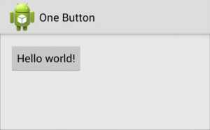
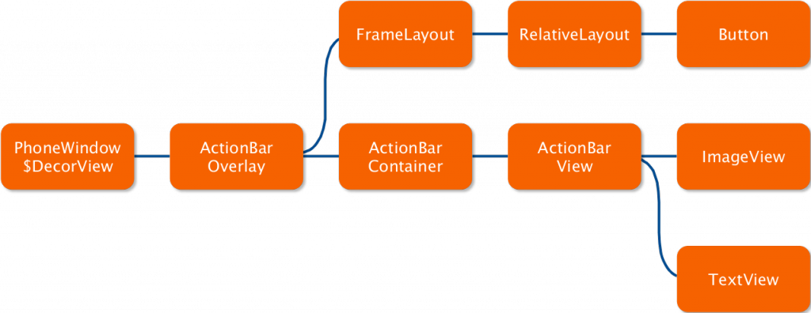
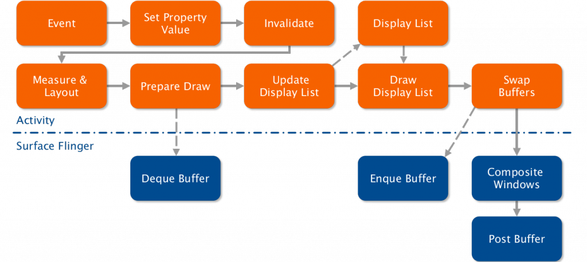
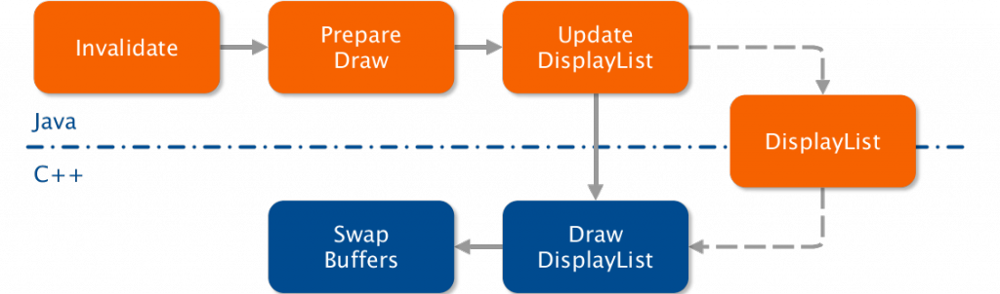
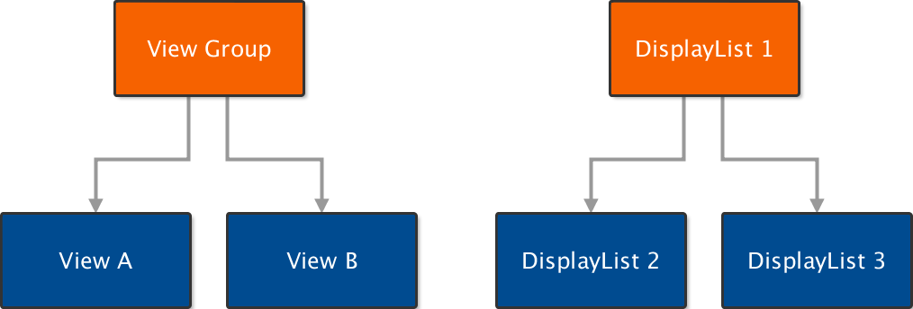
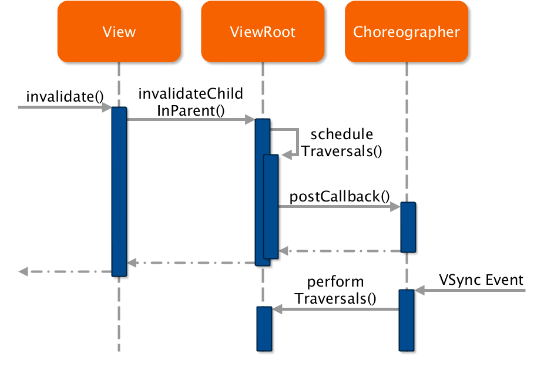
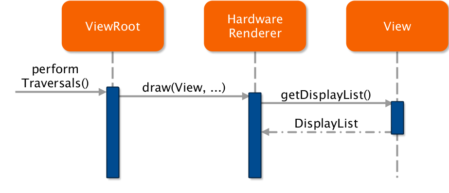
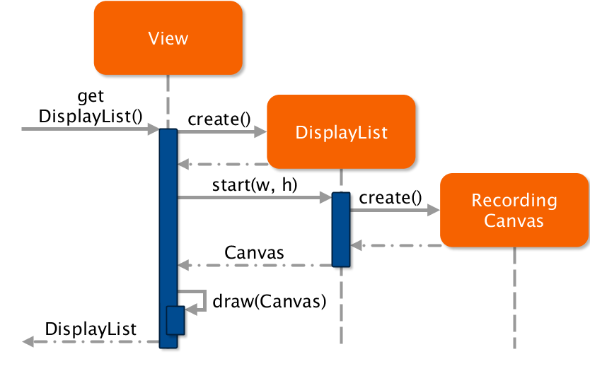
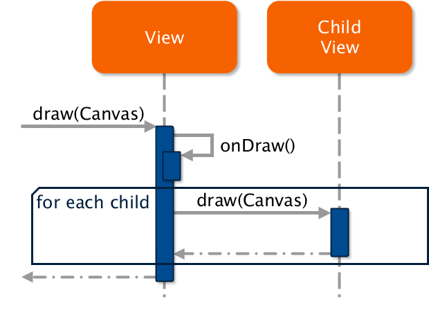

`Android Graphics Pipeline: 从Button到Framebuffer (Part 1)`
---

>
* 原文链接 : [Android Graphics Pipeline: From Button to Framebuffer (Part 1)](https://blog.inovex.de/android-graphics-pipeline-from-button-to-framebuffer-part-1/)
* 译者 : [dupengwei](https://github.com/dupengwei) 
* 校对者: [这里校对者的github用户名](github链接)  
* 状态 :  未完成 / 校对中 / 完成 

In this mini-series of blog articles we want to shed some light on the internals of the Android Graphics Pipeline. Google itself already released some insights and documentation on the subject such as the beautiful Google I/O 2012 talk For Butter or Worse by Chet Haase and Romain Guy (go watch it if you haven’t!) or the article Graphics architecture. While they certainly help to get the big picture involved in getting a simple view displayed on the screen, they are not that helpful when trying to understand the source code behind it. This series will give you a gentle jump start into the interesting world of the Android Graphics Pipeline.

在这个小型博文系列中我们想给有兴趣研究 Android Graphics Pipeline 内部结构的开发者带来一些启发。在此主题上，Google自己也发布了一些见解和文档，如由Chet Haase 和 Romain Guy主持的Google I/O 2012演讲[For Butter or Worse](https://www.youtube.com/watch?v=Q8m9sHdyXnE) (如果没看过就去看看吧!) 和文章 [Graphics architecture](http://source.android.com/devices/graphics/architecture.html) 。虽然这些资料肯定能帮助我们从宏观上理解一个简单的view是如何显示在屏幕上，但是当我们尝试去理解背后的源代码时，这些对我们的帮助并不大。本系列博文将带你走进Android Graphics Pipeline这个有趣的世界。

Beware, a lot of source code and sequence diagrams will be involved in this mini-series! Its worth a read though, especially if you have even the slightest interest in the Android Graphics Pipeline, as you are going to learn a lot (or at least get to look at some pretty pictures). So get yourself a coffee and read on!

请注意，本小型系列博文中会涉及大量的源代码和序列图！它值得一读，就算你对Android Graphics Pipeline一点兴趣也没有，你也可以学到很多（或者你至少看看这些漂亮的图片）。所以给自己一杯咖啡，读吧！

## Introduction

## 引言

In order to fully understand the journey all views undertake on the way to the screen, we will use a small demo app and describe every major stage in the Android Graphics Pipeline, starting with the public Android Java API (SDK), going to native C++ code and finally looking at the raw OpenGL drawing operations.

为了充分理解view显示到屏幕的过程，我们采用一个小Demo来描述Android Graphics Pipeline的每个主要阶段，由Android Java API (SDK)开始，然后是本地C++代码，最后看原始的OpenGL绘图操作。



The demo app in all its glory. This little app is causing enough code-coverage in the Android Graphics internals, so that it’s actually a pretty good example.

这个Demo是相当的光彩夺目。这个小小的app对 Android Graphics的内部结构产生充足的代码覆盖，所以，它实际上是一个相当好的例子。

The activity consists of a simple RelativeLayout, an ActionBar with the application icon and title and a simple Button which reads Hello world!.

这个activity由一个简单RelativeLayout，一个带应用图标和标题ActionBar 和一个读作“Hello world!”的简单Button组成。



The view hierarchy of our simple demo app is actually quite complex.

我们这个简单的Demo的视图层实际上是相当复杂的。

Inside the Android view hierarchy, the relative layout consists of a simple color-gradient background. More complex, the action bar is composed of the background, which is a gradient combined with a bitmap, the One Button text element and the application icon, which is also a bitmap. A 9-Patch is used as the background for the button, and the text element Hello World! is drawn on top of it. The navigation bar and status bar at the top and bottom of the screen are not part of the apps activity, they will be rendered by the  SystemUI  system service instead.

在Android 视图层内部，相对布局（relative layout）由一个简单的颜色渐变背景组成。更复杂的，action bar由一个渐变的背景结合一个bitmap，**One Button**文本元素和应用图标（也是一个bitmap）组成。9-Patch用作按钮的背景，文本**Hello World!**画在它的最上层。屏幕顶部的导航栏和底部的状态栏不属于app的activity部分，它们由系统服务`SystemUI`进行渲染。

## The Big Picture: Pipeline Overview

## 整体情况：Pipeline概述

Having watched the Google I/O talk For Butter or Worse, you will certainly recognize the following slide, which shows the complete Android Graphics Pipeline.

看过Google I/O演讲**For Butter or Worse**，你肯定认识下面的幻灯片，它显示了完整的Android Graphics Pipeline。



The complete Android Graphics Pipeline, as presented at Google I/O 2012.

在Google I/O 2012演讲中提供的完整的Android Graphics Pipeline。

The Surface Flinger is responsible for creating a graphics buffer and compositing it onto the main display and while certainly very important for the Android system, is not covered at this time.

Surface Flinger负责创建图形缓冲区并将其合成到主显示器，虽然这对应安卓系统非常重要，但是在此不做覆盖。

Instead, we will look at a fine selection of components which are doing most of the heavy lifting in bringing the view to the screen:

相反，我们着眼于有多种可供选择的组件，这些组件干着绝大多数的工作将view显示到屏幕。



The interesting bits (at least for these blog posts) of the pipeline.


## Display Lists

As you may already know, Android uses a concept called DisplayLists to render all its views. For those of you who don’t know, a display list is a sequence of graphics commands needed to be executed to render a specific view. These display lists are an important element to achieve the high performance of the Android Graphics Pipeline.

正如你可能已经知道，Android 使用一个叫做DisplayLists的概念去渲染所有的view。对于不知道的人来说，display list是一个绘图命令序列集合，需要执行这些命令去渲染指定的view。display lists是Android Graphics Pipeline达到高性能的重要元素。



Every view of the view hierarchy has a corrsponding display list, which is generated by the views onDraw() method, which every developer knows about. In order to draw the view hierarchy onto the screen, only the display lists need to be evaluated and executed. In case a single view gets invalidated (due to user input, animations or transitions), the affected display lists will be rebuilt and eventually redrawn. This is preventing Android from calling the quite expensive onDraw() methods every frame.

每个视图层的view都有其对应的display list，每个开发者都知道`onDraw()`方法，这个display list就是由view的`onDraw()`方法生成的。为了将视图层画到屏幕上，只有display lists需要被评估并执行。假如某个单一view失效（因用户输入、动画或转换），受影响的display lists将会重建和重绘。这就避免Android在每个frame层调用相当耗费资源的`onDraw()`。

Display lists can also be nested, meaning that a display list can issue a command to draw a childrens display list. This is important in order to be able to reproduce view hierarchies with display lists. After all, even our simple app has multiple nested views.

Display lists 也可以被嵌套，这意味着一个Display list也可以发出一个命令绘制一个子display list。这对复制视图层的display lists来说非常重要。毕竟，即使我们的简单app也具有多个嵌套视图。

These commands are a mixture of statements that can be directly mapped to OpenGL commands, such as translating and setting up clipping rectangles, and more complex commands such as DrawText and DrawPatch. These need a more complex set of OpenGL commands.

这些命令的语句的可以直接映射到OpenGL命令，如翻译和设置剪辑矩阵，或更复杂的命令如`DrawText` 和 `DrawPatch`。这些命令需要更复杂的OpenGL命令集。

`An example of a display list for a button.`

`一个按钮的display list示例`

```java
Save 3
DrawPatch
Save 3
ClipRect 20.00, 4.00, 99.00, 44.00, 1
Translate 20.00, 12.00
DrawText 9, 18, 9, 0.00, 19.00, 0x17e898
Restore
RestoreToCount 0
```

In the example above, you can clearly see what kind of operations are present in a display list for our simple button. The first operation is to save the current translation matrix to the stack, so that it can be later restored. It then proceeds to draw the buttons 9-Patch, followed by another save command. This is necessary because for the text to be drawn, a clipping rectangle is set up to only affect the region that where text will be drawn. Mobile GPUs can take this rectangle as an hint to further optimize the draw calls in later stages. The drawing origin is than translated to the text position and the text is drawn. At the end, the original translation matrix and state is restored from the stack, which also resets the clipping rectangle.

在上面的示例中，你可以清楚地看到一个简单的按钮(绘制过程）display list提供了什么样的操作。第一个操作是保存当前翻译矩阵到栈中，因此它随后可以恢复。然后又画了9-Patch按钮，接下来是另外一个保存命令，这是必要的，因为对于要绘制的文本来说，只有绘制文本的区域才会创建裁剪矩阵。手机绘图处理器将此矩形区域当做一个线索以便在后续阶段对绘图调用进一步优化。然后将绘画圆点转换到文本位置，并绘制文本。最后，最初的转换矩阵和状态从堆中还原，裁剪矩阵也被重置。

The complete log of the display lists for our example application can be seen at the bottom of this post.

在这篇文章的底部可以看到示例用的的display lists的完整日志。

## Diving into code

## 深入代码

With this newly accuired knowledge we are ready to dive into the code.

带着这些新获取的知识，我们准备深入代码。

### Root View

### 根视图（Root View）

Every Android activity has an implicit root view at the top of the view hierarchy, containing exactly one child view. This child is the first real view of the application defined by the application developer. The root view is responsible for scheduling and executing multiple operations such as drawing and invalidating views, among other.

每个Android activity在视图层的最顶层都有一个隐式根视图（Root View），包含一个子view。这个子view是程序员在应用中定义的第一个真正的view。根视图负责调度和执行多种，如绘图，使view无效等等。

Similarly, every view has a reference to its parent. The first view inside the view hierarchy, which the root view references, has this root view as a parent. While serving as a base class for every visible element and widget, the View class does not support any children. However, the derrived ViewGroup supports multiple children and serves as a container base class, which is used by the standard layouts ( RelativeLayout etc.).

类似的，每个view都有一个parent的引用。视图层内部的第一个view将根视图作为parent。虽然View类作为每个可视化的元素或组件的基类，但是它并不支持任何子类。然而，其派生类ViewGroup支持多子类，并作为一个容器基类，它已经被标准布局（RelativeLayout 等等)所采用。

If a view is (partially) invalidated, the view will call the root views invalidateChildInParent() method. The root view keeps track of all invalidated areas and schedules a new traversal at the choreographer, which is performed on the next VSync event.

如果一个view局部重绘，那么该view会调用根视图的invalidateChildInParent()方法。根视图跟踪所有重绘的区域，并在choreographer调度一个新的遍历，choreographer会在下一个VSync事件执行。



ViewRoot: InvalidateChildInParent(…)

```java
public ViewParent invalidateChildInParent(int[] location, Rect dirty) {
    // Add the new dirty rect to the current one
    mDirty.union(dirty.left, dirty.top, 
                 dirty.right, dirty.bottom);
    // Already scheduled?
    if (!mWillDrawSoon) {
        scheduleTraversals();
    }
    return null;
}
```

## Creating the Display Lists

## 创建Display Lists

As previously mentioned, each view is responsible to generate its own display list. When a VSync event is fired and the choreographer called performTraversals on the root view, the  HardwareRenderer is asked to draw the view, which in turn will ask the view to generate its display list.

正如之前提到的，每个view负责生产自己的display list。当一个VSync事件被触发，choreographer调用根视图的`performTraversals`方法，根视图要求`HardwareRenderer`绘制view，`HardwareRenderer`反过来要求view生成自己的display list。



With currently almost 20.000 lines of code, the View  is one of the bigger classes inside the Android framework. This comes as no surprise, as it is the building block for every widget and application. It handles the keyboard, trackball and touch events, as well as scrolling, scrollbars, layouting and measuring, and much, much more.

在Android framework层中，View是其中一个比较大的类，当前代码量将近20000行。这并不令人惊奇，因为它是每个小组件和应用的构建块。它处理键盘、轨迹球、触摸事件,以及滚动,滚动条,布局和测量,还有很多很多。




Called by the Hardware Renderer, the View.getDisplayList(…) method will create a new internal display list, which will be used for rest of the views lifetime. The internal display list is then asked to supply a canvas big enough to accommodate the view. Supplying a  GLES20RecordingCanvas, the view and all its children will use it to draw upon, and is therefore handed to the  draw(…) method. The canvas is somewhat special, as it will not execute drawing commands but rather save them as commands inside the display list. This means that the widgets and every view can use the normal drawing API without even noticing that the commands are rendered to a display list.

`View.getDisplayList(…)`方法被Hardware Renderer调用时将会创建一个内部的display list，这个内部display list将会在view生命周期的剩余部门被使用。然后这个内部display list被要求提供一个足够大的画布来容纳这个view。提供一个GLES20RecordingCanvas，所有view和它的children将会在上面绘图，并传递给`draw(…)`方法。这个画布有点特殊，因为它不执行绘图命令，而是保存命令到display list。这意味着小组件和每个view能使用正常的绘图API，甚至无须关注display list内部的命令

`View: getDisplayList(…)`
```java
private DisplayList getDisplayList(DisplayList displayList, 
                                   boolean isLayer) {
    HardwareCanvas canvas = displayList.start(width, height);
    if (!isLayer && layerType != LAYER_TYPE_NONE) {
        // Layers don't get drawn via a display list
    } else {
        draw(canvas);
    }
    return displayList;
}
```

Inside the draw(…) method, the view will execute the onDraw() code, rendering itself onto the supplied canvas. If the view has any children, it will also call the draw() method of each of them. These children could be anything, from a normal button to another layout or view group, which itself includes another set of children, which will also get drawn.

在`draw(…)`方法中，view将执行`onDraw()`方法的代码，渲染自己到画布上。如果这个view有任何children，children各自调用`draw()`方法。这些children可以是任何东西，可以是一个正常的按钮，也可以是一个布局或view group，这些children包含另外的children，都将被绘制。




## Read on

## 继续读下去

With the generation of the display list this first part comes to an end. Jump to part 2 where we will actually take a look at how these display lists get rendered to the screen!

伴随着display list的产生，第一部分结束了。跳转到第2部分,我们会看看这些display lists如何呈现在屏幕上!

## Download

## 下载

The full Bachelor’s Thesis on which this article is based is available for download.

本文参考的所有学士论文可供[下载](http://mathias-garbe.de/files/introduction-android-graphics.pdf)


