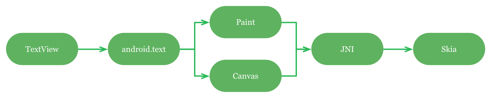
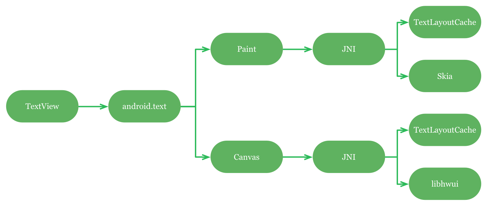
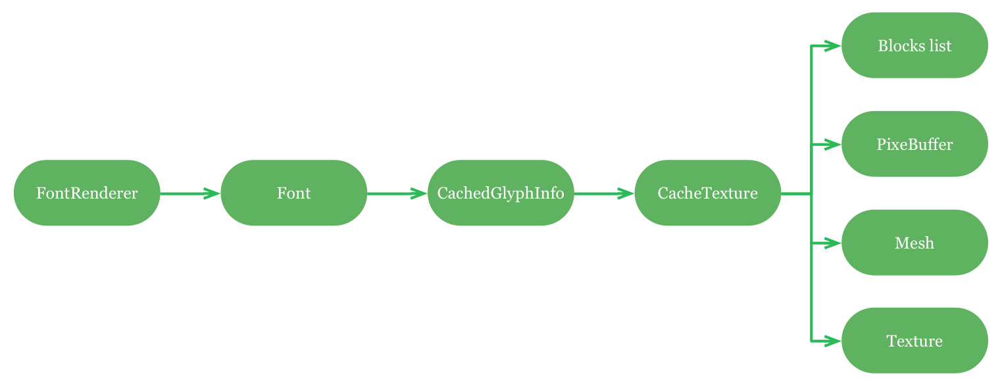

id font renderer](https://medium.com/@romainguy/androids-font-renderer-c368bbde87d9)
* 译者：[7heaven](http://github.com/7heaven)
* 校对者：
* 状态：翻译完成

Any developer with a few years of experience writing client-side applications is acutely aware of how complicated text rendering can be. At least that’s what I thought until 2010 when I started writing libhwui, an OpenGL backend for Android 3.0’s 2D drawing API. I then realized that text gets even more complicated when you’re trying to use a GPU to draw it on screen.

任何一个有几年的客户端应用开发经验的开发者都会知道文本渲染有多复杂。至少我在2010年开始写libhwui(基于OpenGL的安卓2D绘制API)之前是这么认为的。在开始写libhwui后，我意识到如果试图用GPU来渲染文本会使文本渲染变得更复杂。

##Text and Android

##文本与安卓
Android’s hardware accelerated font renderer was originally written by a co-worker on the Renderscript team and was then improved upon and optimized by several engineers including my good friend Chet Haase and I. You can easily find many tutorials on how to render text with OpenGL but most — if not all — articles focus on games and conveniently avoid dealing with difficult issues.

安卓的硬件加速字体渲染最开始是由Renderscript团队的一位同事编写的，后来经过了多位工程师的修改和优化，其中就包括我以及我的朋友Chet Haase。你可以很容易的找到很多关于如何用OpenGL渲染文本的教程。但是，大部分的这些文章都把重点放在游戏开发以及如何绕过一些复杂的问题上。

The approach described here is by no means novel but I thought it would be convenient for some developers to get a high-level overview of how a complete GPU-based text rendering system can be implemented. This article also describes a few optimizations that are easy to implement.

下面的内容并非如小说般的通俗易懂,但我认为它能很容易地给开发者一个如何实现完整的基于GPU的文字渲染系统的总览。文章中同时也描述了几个容易实现的文本渲染的优化。

A common way to render text with OpenGL is to compute a texture atlas that contains all the needed glyphs. This is often done offline using fairly complex packing algorithms to minimize waste in the texture. Creating such an atlas obviously requires to know ahead of time what fonts — this includes face, size and various other properties — and glyphs will be used by the application at runtime.

通常用OpenGL渲染文本的方法是计算一张包含所有需要的字形的纹理集合。这通常是在离线状态下用一个非常复杂的打包算法来最大化的减小纹理集合的资源浪费。创建这样一个纹理集合需要预先知道哪些文本--包括字体、字号以及其他属性等--然后应用就可以在运行时使用这些字形。

Ahead-of-time font texture generation is not a practical solution on Android. The UI toolkit has no way of knowing in advance what fonts and glyph applications will need; applications can even load custom fonts at runtime. This is a major constraint but only one of many that Android’s font renderer must work with:

在安卓上用预先渲染的纹理显然不是一个可行的解决方案。UI组件无法预先得知哪些文本需要被渲染；部分应用甚至会在运行时加载自定义字体。这是个主要的约束，但是这仅仅是其中一个：

* It must build its font cache at runtime

* 必须在运行时建立字体缓存

* It must be able to handle a large number of fonts

* 必须能处理数量巨大的字体

* It must be able to handle a large number of glyphs

* 必须能处理数量巨大的字形

* It must minimize texture waste

* 必须最大化地减小纹理浪费

* It must be fast

* 渲染速度必须够快

* Work equally well on low-end and high-end devices

* 在高端和低端机型上必须效果一致

* Work perfectly with any driver/GPU combo

* 在任何驱动/GPU组合上都必须完美运行

##Implementing the font renderer

##实现字体渲染

Before we examine how the low-level OpenGL font renderer works, let’s start with the high-level APIs directly used by applications. These APIs are important to understand how libhwui works.

在我们研究底层OpenGL文字渲染是如何实现之前，我们先来看看应用中直接调用的上层接口。这些接口对理解libhwui如何工作是非常重要的。

### Text APIs

###文本接口

There are 4 main APIs that application use to layout and draw text:

应用中用来排版和绘制文本的主要API有4个：

* android.widget.TextView, a View that handles layout and rendering

* android.widget.TextView，一个处理排版和渲染的控件

* android.text.*, a collection of classes to create stylized text and layouts

* android.text.*，创建风格化文本和文本布局的类集合

* android.graphics.Paint, to measure text

* android.graphics.Paint，文本测量

* android.graphics.Canvas, to render text

* android.graphics.Canvas，文本渲染

Both TextView and android.text are high-level implementations on top of Paint and Canvas. Up until Android 3.0, both Paint and Canvas were implemented directly on top of Skia, a software rendering library. Skia provides a nice abstraction of Freetype, a popular Open Source font rasterizer.

TextView以及android.text都是以Paint和Canvas为基础的顶层实现。在安卓3.0之前Paint和Canvas都是直接由[Skia](https://code.google.com/p/skia/)(软件渲染库)实现的顶层API，Skia提供一个抽象库叫[Freetype](http://www.freetype.org/),一个流行的开源字体光栅化器。

> Android software text rendering

>安卓软件文本渲染
>

As of Android 4.4 things are a little bit more complicated. Both Paint and Canvas use an internal JNI API called TextLayoutCache that handles complex text layouts (CTL). This API relies on Harfbuzz, an Open Source text shaping engine. The input of TextLayoutCache is a font and a Java UTF-16 string and its output is a list of glyph identifiers with their x/y positions.

安卓4.4以后整个过程变得有点复杂。Paint和Canvas用一个叫TextLayoutCache的内部JNI接口来实现复杂的文本排版布局(CTL)。这个接口依赖于[Harfbuzz](http://www.freedesktop.org/wiki/Software/HarfBuzz/),这是一个开源的文字shaping引擎。TextLayoutCache接受字体和UTF-16编码的字符串输入，并输出一个包含了x，y坐标的字形标示列表。

TextLayoutCache is the key to properly support many non-Latin locales such as Arabic, Hebrew, Thai… I will not explain how TextLayoutCache and Harfbuzz work but I strongly recommend you learn about CTL if you ever want — and you should — to properly support non-Latin locales in your applications. This particular problem is rarely, if ever, discussed in tutorials about rendering text with OpenGL. Drawing text can be a lot more complicated than simply placing one glyph after another, from left to right. Some languages, Arabic for instance, go right to left and some, like Thai, even require glyphs to be positioned above or below previous glyphs.

TextLayoutCache是处理非拉丁文字，包括阿拉伯文、希伯来文、泰文等的关键。这边我不详细解释关于TextLayoutCache和Harfbuzz是如何工作的。但是如果你想在你的应用中更好的支持非拉丁文字，我强烈建议你学习CTL(复杂文本排版布局)的相关知识。这个问题极少在讨论用OpenGL渲染文本的教程中提到。绘制文本会比单纯地从左到右一个接一个地摆放字形更复杂。部分语言，例如阿拉伯语，是从右到左排列的。泰文甚至需要把字形从上到下 或者从下到上排列。

> Android hardware accelerated text rendering

>安卓硬件加速文字渲染
>

All this means that when you call Canvas.drawText(), directly or indirectly, the OpenGL renderer does not receive the arguments you send, but an array of numbers — the glyph identifiers — and an array of x/y positions.

所有这些意味着当你调用Canvas.drawText()，不管是直接还是间接调用。OpenGL渲染器都不会接收到你发送的参数，而只是接收到一个字形标示以及x/y坐标的数组。

###Rasterization & caching

###光栅化和缓存

Every draw call to the font renderer is associated to a single font. A font is used to cache individual glyphs. A glyph is in turn stored in a cache texture (but a cache texture can contain glyph from multiple fonts). The cache texture is an important object that holds multiple buffers: a list of free blocks, a pixel buffer, a handle to the OpenGL texture and a vertex buffer (the mesh).

所有字体渲染的调用都要有字体的配合。字体用来缓存多个独立的字形。字形储存在一个缓存纹理上(一个缓存纹理可以包含不同字体的字形)。缓存纹理是用来存放多个缓存的重要对象：一个空的块列表、一个像素缓存、OpenGL纹理和顶点缓存(the mesh)。

>Caching architecture

>缓存结构
>

The data structures used to store all these objects are fairly simple:

用来储存所有这些对象的数据结构很简单：

* Fonts are stored in a LRU cache in the font renderer

* 字体储存在字体渲染器的一个LRU缓存中

* Glyphs are stored in a map in each font (the key is the glyph identifier)

* 字形存放在每一个字体的映射集中(the key is the glyph identifier)

* Cache textures track free space with a linked list of blocks

* 缓存纹理用一个块链表来追踪剩余空间

* A pixel buffer is an array of uint8_t or uint32_t(for alpha and RGBA caches)

* 像素缓存为uint8 或者 uint32_t的数组(alpha以及RGB缓存)

* A mesh is a buffer of vertex with two attributes:x/y positions and u/v coordinates

* mesh是一个包含x/y坐标和u/v坐标的顶点缓存

* A texture is a GLunit handle

* 纹理是一个GLunit句柄


When the font renderer initializes, it creates two types of cache textures: alpha and RGBA. Alpha textures are used to store regular glyphs; since fonts do not contain color information, we only need to store anti-aliasing information. The RGBA caches are used to store emojis.


字体渲染器初始化的时候会创建两种类型的缓存纹理：alpha和 RGBA。Alpha纹理用来储存普通的字形；字体本身不包含颜色信息，所以我们只需要储存抗锯齿相关的信息。RGBA缓存用来储存emoji表情。

For each type of cache texture, the font renderer creates several instances of CacheTexture, of various sizes. The size of the caches can be different from device to device but here are the default sizes (the number of caches is hard coded):

字体渲染器会为每种类型的纹理创建多个针对不同尺寸的CacheTexture实例。缓存的尺寸在不同设备上不一样，下面是几个默认的尺寸(缓存的数量是硬编码的)：

* 1024x512 alpha缓存
* 2048x256 alpha缓存
* 2048x256 alpha缓存
* 2048x512 alpha缓存
* 1024x512 RGBA缓存
* 2048x256 RGBA缓存

When a CacheTexture object is created, its underlying buffers are not automatically allocated. The font renderer allocates them as needed, except for the 1024x512 alpha cache, which is always allocated.

CacheTexture实例创建后，它下面的缓存并不会自动分配。字体渲染器会根据需要来分配，1024x512alpha缓存作为一个例外每次都会分配。

Glyphs are packed in the textures in columns. Whenever the renderer encounters a glyph that is not cached, it asks each CacheTexture of the appropriate type — in the order listed above — to cache that glyph.

字形会在纹理中被打包成多个列。当渲染器遇到一个没有缓存的字形时，它会要求上面列表中对应类型的CacheTexture缓存该字形。

This is where the list of blocks gets used. That list contains, for a given cache texture, the list of currently allocated columns plus all the available empty space. If a glyph fits in an existing column, it is added at the bottom of the occupied space in said column.

这时候上面提到的块列表就登场了。这个列表包含了给定缓存纹理的已分配空间加上可用空间。如果一个已存在的列可以容纳下某个字形，那么这个字形就会被添加到这个列的已占用空间的底部。

If all columns are occupied, a new column is carved out of the left side of the remaining space. Since few fonts are monospaced, the renderer rounds the width of each glyph to a multiple of 4 pixels (by default). This is a good compromise between columns reuse and texture packing. The packing is not optimum, but it offers as fast implementation.

如果所有的列都被占用，它便会在左边的剩余空间中创建一个新列。由于部分字体是等宽字体，渲染器会把每一个字形的宽度四舍五入到4的倍数(默认情况下)。打包并不是最优解，但是它提供了一个快速实现方法。

All glyphs are stored in the textures with an empty border of 1 pixel around them. This is necessary to avoid artifacts when the font textures are sampled with bilinear filtering.

所有储存在纹理中的字形都由一个空的一像素的边包围。这是为了避免在双线性过滤时需要对字体纹理进行人工干预处理。

It is also important to know that when text is rendered with scale transform, the transform is forwarded to Skia/Freetype. This means that glyphs are stored transformed in the cache textures. This improves rendering quality at the expense of performance. Fortunately, text is rarely animated scaling and when it is, only a few glyphs are affected. I have run extensive tests and I couldn’t find a realistic use case where performance was an issue.

这边需要了解的一个重点是当文本在渲染的时候做了缩放变换，这些变换会被交给Skia/Freetype。这表示这些字形是以变换后的形态储存在缓存纹理中。这在提高渲染质量的同时造成性能损耗。幸运的是，文本很少做动画缩放，即使做了动画缩放也只影响到少部分的字形。我做了大量的测试也没有出现性能造成比较大影响的情况。

There are other paint properties that affect how glyphs are rasterized and stored: fake bold, text skew, text scale X (which is handled differently from the Canvas transform matrix), style and stroke width.

粗体、斜体、文本x轴缩放(这边不是用canvas的变换矩阵来处理)、样式和线宽等属性也会影响字形的光栅化和储存。

###Rasterization alternatives?

###光栅化代替方案

There are other ways to handle text on the GPU. Glyphs could for instance be rendered directly as vectors but doing so is rather expensive. I’ve also looked into signed distance fields but simple implementations suffer from precision issues (curves tend to become “wobbly”).

有另外一种用GPU处理文本的方法。字形可以直接用顶点向量的方式渲染，但是这样开销非常大。我也稍微研究了一下有向距离场，但是简单的实现方式会导致精确度的问题(curves tend to become "wobbly").

That said, I recommend you take a look at Glyphy, an Open Source library from Harfbuzz’s author, that expand on the signed distance fields technique and fixes the precision issues. I haven’t looked at it in a while but last time I did the shaders cost was prohibitive for use on Android.

建议看一下[Glyphy](https://code.google.com/p/glyphy/)，这是一个由Harfbuzz的作者写的开源库，扩展了有向距离场技术并解决了精度的问题。我有一段时间没关注这个项目了，上次看的时候着色器开销在安卓上还是禁止的。

###Pre-caching

###预缓存

Caching glyphs is an obvious thing to do but pre-caching is even better. Since libhwui is a deferred renderer (as opposed to Skia’s immediate mode), all the glyphs that will be drawn on screen are known at the beginning of a frame. During the sorting of the display list operations (for batching and merging), the font renderer is asked to pre-cache as many glyphs as possible.

缓存字形是理所当然的，但是预缓存会更好一点。由于libhwui是一个延迟渲染器(和Skia的即时模式相反)，所有即将被绘制到屏幕上的字形在帧开始时都是预知的。在显示列表操作的排序过程中(批处理和合并)，字体渲染器会被要求尽可能多的预先缓存字形。

The main advantage of doing this is to completely avoid, or at least minimize, the number of texture uploads mid-frame. Texture uploads are expensive operations that can stall the CPU and/or the GPU. Even worse, modifying a texture during a frame can create severe memory pressure on some GPU architectures.

这样做的主要优势是完全或者 最大化的避免纹理在两帧之前的上传数量。纹理上传是一个开销极大的操作，会导致CPU或者GPU的延迟。更严重的是，在部分GPU架构上帧间修改纹理会导致内存紧张。

ImaginationTech’s PowerVR SGX GPUs use a deferred tiling architecture that has many interesting properties but that forces the driver to make a copy of each texture that you modify during the frame. Since font textures are fairly large, it can be easy to run out of memory if you’re not careful with your texture uploads.

ImaginationTech公司的PowerVR SGX 系列GPU用了一个很有意思的延迟tiling架构，但是会强制驱动保留一份帧间修改的纹理的备份。字体纹理是非常大的，如果不注意纹理上传问题很容易导致内存溢出。

This actually happened with an application on Google Play. This app is a simple calculator that simply draws buttons with math symbols and numbers. The font renderer was however at some point incapable of rendering the first frame without running out of memory. Because the buttons were drawn one after the other, each one of them would trigger a texture upload, and thus a copy of the entire font cache. The system simply did not have enough memory to hold that many copies of the cache.

Google Play上的一款应用就出现了这个问题。这款应用是一个简单的计算器，包含多个有数学符号和数字的按钮。字体渲染器在第一帧渲染的时候内存溢出了。因为按钮是按顺序绘制的。每一个按钮的绘制都会触发纹理上传。以及对整个字体缓存的拷贝。系统没有足够的内存来维持这么多的缓存拷贝。

###Flushing caches

###清理缓存

The textures used to cache glyphs being fairly large, they are also sometimes reclaimed by the system to give other applications more RAM.

缓存字形的纹理非常大，它们在部分情况下会被系统回收来把空间让给其他应用。

Whenever the user hides the current application, the system sends the application a message asking it to release as much memory as possible. The obvious thing to do is to destroy the largest cache textures. On Android, the large textures are considered to be all the cache textures but the first one ever created (1024x512 by default).

当用户让应用进入后台的时候，系统会发送一条要求释放尽可能多内存的信息给应用。最显而易见的方式就是销毁最大得缓存纹理。在安卓系统上，所有除了第一个创建的缓存纹理（默认是1024x512）都被视为大型纹理。

Textures also get flushed when no space can be found in any of the caches. The font renderer keeps track of the fonts with an LRU but doesn’t do anything interesting with it. If needed, flushing the caches could be made smarter by flushing seldom used textures instead. This has not proved necessary so far but it’s a potential optimization to keep in mind.

当所有缓存都没有任何剩余空间得时候，纹理也会被清理掉。字体渲染器用LRU来追踪字体，但不对它做任何操作。如果需要的话，可以选择清理相对使用较少的纹理，这样更加智能化。现在还没有证据证明这是必须的，但是这是一个潜在的优化策略。

###Batching & merging

###批处理和合并

Android 4.3 introduced batching and merging of drawing operations, an important optimization that drastically reduces the number of commands issued to the OpenGL driver.

安卓4.3引入了[批处理和合并](https://www.youtube.com/watch?v=vQZFaec9NpA)绘制操作，彻底降低了OpenGL驱动的指令问题数量，是一个很重要的优化策略。

To help with merging, the font renderer buffers text geometry across multiple draw calls. Each cache texture owns a client-side array of 2048 quads (1 quad = 1 glyph) and they all share a single index buffer (stored as a VBO on the GPU). When a text draw call is issued inside libhwui, the font renderer fetches the appropriate mesh for each glyph and writes the positions and u/v coordinates into it. Meshes are sent to the GPU at the end of a batch (as decided by the deferred display lists system) or when a quad buffer is full. It is possible for multiple meshes to be required to render a single string, one per cache texture.

为了实现合并，字体渲染器在多个绘制请求上对文本几何结构进行缓存。每一个缓存纹理用于一个2048 quad的客户端数组(1 quad = 一个字形),他们共享一个索引缓存（在GPU中储存为一个VBO）。当libhwui内部发起一个绘制请求时，字体渲染器会为每一个字形获取一个mesh并把x/y坐标和u/v坐标写进去。mesh在批处理的最后或者在quad缓存满得时候被发送给GPU(由延迟显示列表系统中所描述)。有可能在渲染一个字符串的时候会有多个mesh，每个缓存纹理一个。

This optimization is easy to implement and greatly helps with performance. Since the font renderer uses multiple cache textures there are pathological cases where most glyphs in a string are part one of texture and some are part of another. Without the batching/merging optimization, a draw call would be issued to the GPU every time the font renderer needs to switch to a different cache texture.

这个优化策略容易实现，并且对性能提升有很大帮助。由于字体渲染器使用多个缓存纹理，导致字符串中的大部分字形一部分在一个纹理中，一部分在另一个纹理中。如果没有批处理/合并优化策略，每次字体渲染器需要切换不同缓存纹理的时候都会发起一个绘制请求给GPU。

I have actually seen this problem occur in a test app I was using for the font renderer. The app was simply rendering the “hello world” string with different styles and sizes and in one particular case, the letter “o” was stored in a different texture than the other glyphs. This would cause the font renderer to draw “hell”, then “o”, then “w”, then “o”, then “rld”. That’s 5 draw calls and 5 texture binds when only 2 of each are actually necessary. The renderer now draws “hell w rld” then the two “o” together.

我用来测试字体渲染器的一个应用上就出现了这个问题。这个应用用不同的样式和尺寸渲染一个"Hello world"字符串。"o"字被储存在和其他字符不同的纹理中。这会导致字体渲染器先绘制"hell", 然后是"o","w","o", 最后是"rld"。一共五次绘制请求以及5次纹理绑定，但实际上只需要两个纹理。使用优化后，渲染器会先绘制"hell w rld"然后再同时绘制两个"o"。

###Optimizing texture uploads

###优化纹理上传

I mentioned earlier that the font renderer tries to upload as little data as possible when updating the cache textures by tracking the dirty rectangle in each texture. There are unfortunately two limitations with this approach.

我之前提到字体渲染器在上传缓存纹理的时候会追踪每个纹理的dirty rectangle来尽可能地上传最少量的数据。但是这种方式有两个限制。

First, OpenGL ES 2.0 does not allow the upload of an arbitrary sub-rectangle. glTexSubImage2D lets you specify the x/y and width/height of the rectangle to update inside the texture but it assumes that the stride of the data in main memory is the width of that rectangle. This can be worked around by creating new CPU buffers of the appropriate size but it requires knowing ahead of time how big the dirty rectangle will be.

首先，OpenGL ES 2.0不允许上传长方形的任意一个部分。glTexSubImage2D允许你指定纹理内部的长方形的x/y和宽高but it assumes that the stride of the data in main memory is the width of that rectangle.可以通过创建一个新的合适大小的CPU缓存来绕过这个问题，但是这就需要预先知道长方形的大小。

A good compromise is to upload the smallest band of pixels that contains the dirty rectangle. Since that band is always as wide as the texture itself we can end up wasting quite a bit of bandwidth but it’s better than updating the entire texture.

一个妥协的办法是上传包含这个长方形的最小带宽的像素(smallest band of pixels)。由于带宽总是和纹理本身一样宽所以我们还是会浪费掉部分带宽，但是这总好过上传整个纹理。

The second problem is that texture uploads are synchronous calls. This can lead to fairly long CPU stalls (up to about a millisecond or more depending on the size of the texture, the driver and the GPU). This doesn’t matter too much when pre-caching works as expected but the issue can be felt by the user when using font-heavy applications or locales that use many glyphs (such as Chinese).

第二个问题是纹理上传是同步的。这会导致CPU长时间的停顿（多至一毫秒，取决于纹理大小、驱动和CPU）。这在预缓存正常工作的情况下并不是大问题，但是在使用大量文本的应用或者使用大量字形的语言(例如中文)的时候用户会感受到停顿。

OpenGL ES 3.0 thankfully offers a solution to these two issues. It is now possible to upload a sub-rectangle using a new pixel store property called GL_UNPACK_ROW_LENGTH. This property specifies the stride or the source data in main memory. Be careful though: this property affects the global state of the current OpenGL context.

OpenGL ES 3.0提供了这两个问题的解决方案。用一个叫GL_UNPACK_ROW_LENGTH的像素储存新属性可以上传一个长方形的一部分。这个属性指定了幅度或者主内存中的原始数据。但请注意：这个属性会对当前的OpenGL上下文的全局状态造成影响。

CPU stalls during texture uploads can be avoided by using pixel-buffer objects, or PBOs. Like all buffer objects in OpenGL, PBOs reside in the GPU but can be mapped in main memory. PBOs have many interesting properties but the one we care about is that they enable asynchronous texture uploads after they are unmapped from main memory. The sequence of operations becomes:

通过使用像素缓存对象或者PBO可以避免CPU停顿。类似于OpenGL中的其他缓存对象，PBO reside in the GPU but can be mapped in main memory.PBO有很多有趣的属性，但是其中最让我们关注的事它允许异步上传纹理。整个操作过程变成：

```
glMapBufferRange->把字形写入缓存->glUnmapBuffer->glPixlStorei(GL_UNPACK_ROW_LENGTH)->glTexSubImage2D
```
The call to glTexSubImage2D now returns immediately instead of blocking the renderer. The font renderer currently maps the entire buffer in main memory and even though it doesn’t seem to cause performance issues it would probably be a good idea to try and map only the range required to update the cache texture.

对glTexSubImage2D的调用现在会立刻返回而不会阻断渲染器。字体渲染器会同时把整个缓存映射到主内存中。虽然这不太可能导致性能问题，但是最好处理方式还是只映射更新缓存纹理所必须的那一部分。

These two OpenGL ES 3.0 specific optimizations appeared in Android 4.4.

这两个OpenGL ES 3.0的优化策略[已经在安卓4.4中实现](https://plus.google.com/+RomainGuy/posts/9QSTyVCSoz3)

###Drop shadows

###投影

Text is commonly rendered with drop shadows, a fairly expensive operation. Since neighboring glyphs will blur into each other, the font renderer cannot pre-blur glyphs independently. There are many ways blurring could be implemented, but to minimize blending operations and texture sampling during a frame, drop shadows are simply stored as textures and survive across multiple frames.

文本通常在渲染的时候会带上阴影。这是一个开销较大的操作。由于相邻的字形的阴影模糊会互相影响，字体渲染器无法预先对字形进行模糊化。实现模糊的方法很多，但为了减小每帧间的混合操作和纹理取样，投影会以纹理的形式储存并延续到多个帧。

Since applications can easily max out the GPU, we decided to rely on the CPU to blur text. The easiest and most efficient way to do this is to use Renderscript’s C++ API. It requires only a few lines of code and takes advantage of all the available cores. The only trick is to specify the RS_INIT_LOW_LATENCY flag when initializing Renderscript to force it to execute the work on the CPU.

由于应用很容易让GPU超负荷，我们决定把模糊化交给CPU处理。最简单和高效的处理方法是使用RenderScript的C++ 接口。只需要几行代码and takes advantage of all the available cores.唯一需要注意的是初始化Renderscript的时候要指定RS_INIT_LOW_LATENCY标示来把操作交给CPU执行。

###Future optimizations?

###未来的优化策略？

There is one optimization that I wish I had time to implement before I left the Android team. Text pre-caching, asynchronous and partial texture updates are all important optimizations but rasterizing glyphs remains an expensive operation. This can easily be seen in systrace. (Enable the gfx tag and look for precacheText events).

在我离开安卓团队前有一个优化策略我希望能够实现。文本预缓存，异步以及部分纹理更新都是相当重要的优化方式，但是字形的光栅化依然是一个开销极大的操作。在systrace里很容易看出来。(勾选gfx标签并找到precacheText事件)。

An easy way to optimize the pre-caching pass is to use worker threads to perform glyphs rasterization in the background. This technique is already used to rasterize complex paths that are not rendered as OpenGL geometry.

一个简单的优化方法是在后台使用worker线程来执行字形光栅化。这种技巧在不渲染成OpenGL几何体的复杂路径光栅化上已经得到应用。

It should also be possible to improve the batching and merging of text rendering operations. The color used to draw a piece of text is currently sent to the fragment shader as a uniform. This reduces the amount of vertex data sent to the GPU but has the unfortunate side-effect of generating more command batches than necessary: a batch can only contain text of a single color. If the text color was instead stored as a vertex attribute fewer batches could be issued to the GPU.

文本渲染的批处理和合并也有潜在的提升空间。用来绘制文本的部分的颜色是以整体的形式发送给碎片着色器的。这降低了发送给GPU的顶点数据但是同时也导致了副作用，会产生不必要得批处理指令：一个批处理只能包含单色的文本。如果以顶点的属性方式储存会减少发送给GPU的批处理指令。

###Source code

###源码

You can visit libhwui’s GitHub if you want to take a closer look at the font renderer’s implementation. You can start with FontRenderer.cpp where most of the magic happens. Its supporting classes can be found in the font/ sub-directory. You might also find PixelBuffer.cpp useful. It’s a simple abstraction of a pixel buffer that can be backed either by a CPU buffer (a simple uint8_t array) or a GPU buffer (a PBO).

如果你需要深入研究字体渲染器的实现可以访问libhwui的[github地址](https://github.com/android/platform_frameworks_base/tree/master/libs/hwui)。大部分操作都在[FontRenderer.cpp](https://github.com/android/platform_frameworks_base/blob/master/libs/hwui/FontRenderer.cpp)中，所以你可以选择从这个类开始看。和它相关的类在[font/](https://github.com/android/platform_frameworks_base/tree/master/libs/hwui/font)的子文件夹中。[PixelBuffer.cpp](https://github.com/android/platform_frameworks_base/blob/master/libs/hwui/PixelBuffer.cpp)也非常有帮助。这是一个由CPU缓存(uint8_t数组)或者GPU缓存(PBO)支持的像素缓存的抽象类。

You will notice the use of several configuration properties in the source code. They are all described in Android’s Performance Tuning documentation.

你会发现源代码中有一些配置属性。这些属性在安卓的[性能调节](http://source.android.com/devices/tuning.html)文档中有描述。

###Parting words

###题外话

This article only constitutes a brief introduction to Android’s font renderer. There are many details about the implementation that I ignored or would merit further explanations so do not hesitate to ask me questions.

这篇文章仅仅是对安卓字体渲染器的简单介绍。还有很多实现的细节被我略过或者会出现在我其他的文章中。有问题请尽管提出。
