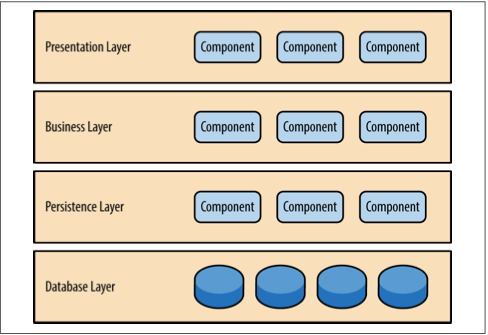
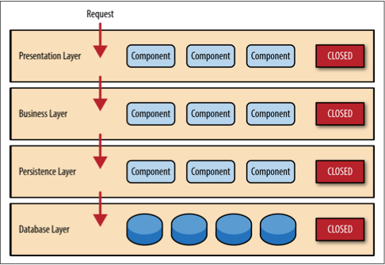
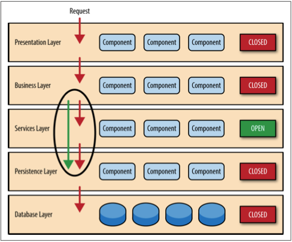
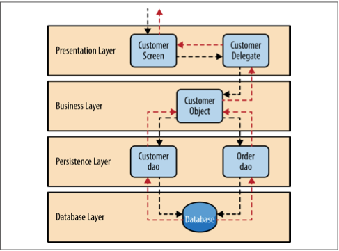

# 第一章 分层架构 

The most common architecture pattern is the layered architecture pattern, otherwise known as the n-tier architecture pattern. This pattern is the de facto standard for most Java EE applications and therefore is widely known by most architects, designers, and devel‐ opers. The layered architecture pattern closely matches the tradi‐ tional IT communication and organizational structures found in most companies, making it a natural choice for most business appli‐ cation development efforts.

分层架构是一种很常见的架构模式，它也叫N层架构。这种架构是大多数Jave EE应用的实际标准，因此很多的架构师，设计师，还有程序员都知道它。许多传统IT公司的组织架构和分层模式十分的相似。所以它很自然的成为大多数应用的架构模式。

## Pattern Description
Components within the layered architecture pattern are organized into horizontal layers, each layer performing a specific role within the application (e.g., presentation logic or business logic). Although the layered architecture pattern does not specify the number and types of layers that must exist in the pattern, most layered architec‐ tures consist of four standard layers: presentation, business, persis‐ tence, and database (Figure 1-1). In some cases, the business layer and persistence layer are combined into a single business layer, par‐ ticularly when the persistence logic (e.g., SQL or HSQL) is embed‐ ded within the business layer components. Thus, smaller applications may have only three layers, whereas larger and more complex business applications may contain five or more layers.

分层架构模式里的组件被分成几个平行的层次，每一层都代表了应用的一个功能(展示逻辑或者业务逻辑)。尽管分层架构没有规定自身要分成几层几种，大多数的结构都分成四个层次:展示层，业务层，持久层，和数据库层。如表1-1，有时候，业务层和持久层会合并成单独的一个业务层，尤其是持久层的逻辑绑定在业务层的组件当中。因此，有一些小的应用可能只有3层，一些有着更复杂的业务的大应用可能有5层或者更多的分层。

Each layer of the layered architecture pattern has a specific role and responsibility within the application. For example, a presentation layer would be responsible for handling all user interface and browser communication logic, whereas a business layer would be responsible for executing specific business rules associated with the request. Each layer in the architecture forms an abstraction around the work that needs to be done to satisfy a particular business request. For example, the presentation layer doesn’t need to know or worry about how to get customer data; it only needs to display that information on a screen in particular format. Similarly, the business layer doesn’t need to be concerned about how to format customer data for display on a screen or even where the customer data is coming from; it only needs to get the data from the persis‐ tence layer, perform business logic against the data (e.g., calculate values or aggregate data), and pass that information up to the pre‐ sentation layer.

分层架构中的每一层都着特定的角色和职能。举个例子，展示层负责处理所有的界面展示以及交互逻辑，业务层负责处理请求对应的业务。架构里的层次是具体工作的高度抽象，它们都是为了实现某种特定的业务请求。比如说展示层并不需要关心怎样得到用户数据，它只需在屏幕上以特定的格式展示信息。业务层并不关心要展示在屏幕上的用户数据格式，也不关心这些用户数据从哪里来。它只需要从持久层得到数据，执行与数据有关的相应业务逻辑，然后把这些信息传递给展示层。

    
Figure 1-1. Layered architecture pattern

One of the powerful features of the layered architecture pattern is the separation of concerns among components. Components within a specific layer deal only with logic that pertains to that layer. For example, components in the presentation layer deal only with pre‐ sentation logic, whereas components residing in the business layer deal only with business logic. This type of component classification makes it easy to build effective roles and responsibility models into your architecture, and also makes it easy to develop, test, govern, and maintain applications using this architecture pattern due to well-defined component interfaces and limited component scope.

分层架构的一个突出特性是组件间关注点分离 (separation of concerns)。一个层中的组件只会处理本层的逻辑。比如说，展示层的组件只会处理展示逻辑，业务层中的组件只会去处理业务逻辑。多亏了组件分离，让我们更容易构造有效的角色和强力的模型。这样应用变的更好开发，测试，管理和维护。

## Key Concepts
Notice in Figure 1-2 that each of the layers in the architecture is marked as being closed. This is a very important concept in the lay‐ ered architecture pattern. A closed layer means that as a request moves from layer to layer, it must go through the layer right below it to get to the next layer below that one. For example, a request origi‐ nating from the presentation layer must first go through the busi‐ ness layer and then to the persistence layer before finally hitting the database layer.

注意表1-2中每一层都是封闭的。这是分层架构中非常重要的特点。这意味request必须一层一层的传递。举个例子，从展示层传递来的请求首先会传递到业务层，然后传递到持久层，最后才传递到数据层。

     
Figure 1-2. Closed layers and request access

So why not allow the presentation layer direct access to either the persistence layer or database layer? After all, direct database access from the presentation layer is much faster than going through a bunch of unnecessary layers just to retrieve or save database infor‐ mation. The answer to this question lies in a key concept known as layers of isolation.

那么为什么不允许展示层直接访问数据层呢。如果只是获得以及读取数据，展示层直接访问数据层，比穿过一层一层来得到数据来的快多了。这涉及到一个概念:层隔离。

The layers of isolation concept means that changes made in one layer of the architecture generally don’t impact or affect components in other layers: the change is isolated to the components within that layer, and possibly another associated layer (such as a persistence layer containing SQL). If you allow the presentation layer direct access to the persistence layer, then changes made to SQL within the persistence layer would impact both the business layer and the pre‐ sentation layer, thereby producing a very tightly coupled application with lots of interdependencies between components. This type of architecture then becomes very hard and expensive to change.

层隔离就是说架构中的某一层的改变不会影响到其他层:这些变化的影响范围限于当前层次。如果展示层能够直接访问持久层了，假如持久层中的SQL变化了，这对业务层和展示层都有一定的影响。这只会让应用变得紧耦合，组件之间互相依赖。这种架构会非常的难以维护。

The layers of isolation concept also means that each layer is inde‐ pendent of the other layers, thereby having little or no knowledge of the inner workings of other layers in the architecture. To understand the power and importance of this concept, consider a large refactor‐ ing effort to convert the presentation framework from JSP (Java Server Pages) to JSF (Java Server Faces). Assuming that the contracts (e.g., model) used between the presentation layer and the business layer remain the same, the business layer is not affected by the refac‐ toring and remains completely independent of the type of user- interface framework used by the presentation layer.

从另外一个方面来说，分层隔离使得层与层之间都是相互独立的，架构中的每一层的互相了解都很少。为了说明这个概念的牛逼之处，想象一个超级重构，把展示层从JSP换成JSF。假设展示层和业务层的之间的联系保持一致，业务层不会受到重构的影响，它和展示层所使用的界面架构完全独立。

While closed layers facilitate layers of isolation and therefore help isolate change within the architecture, there are times when it makes sense for certain layers to be open. For example, suppose you want to add a shared-services layer to an architecture containing com‐ mon service components accessed by components within the busi‐ ness layer (e.g., data and string utility classes or auditing and logging classes). Creating a services layer is usually a good idea in this case because architecturally it restricts access to the shared services to the business layer (and not the presentation layer). Without a separate layer, there is nothing architecturally that restricts the presentation layer from accessing these common services, making it difficult to govern this access restriction.

然而封闭的架构层次也有不便之处，有时候也应该开放某一层。如果想往包含了一些由业务层的组件调用的普通服务组件的架构中添加一个分享服务层。在这个例子里，新建一个服务层通常是一个好主意，因为从架构上来说，它限制了分享服务访问业务层(也不允许访问展示层)。如果没有隔离层，就没有任何架构来限制展示层访问普通服务，难以进行权限管理。

In this example, the new services layer would likely reside below the business layer to indicate that components in this services layer are not accessible from the presentation layer. However, this presents a problem in that the business layer is now required to go through the services layer to get to the persistence layer, which makes no sense at all. This is an age-old problem with the layered architecture, and is solved by creating open layers within the architecture.
As illustrated in Figure 1-3, the services layer in this case is marked as open, meaning requests are allowed to bypass this open layer and go directly to the layer below it. In the following example, since the services layer is open, the business layer is now allowed to bypass it and go directly to the persistence layer, which makes perfect sense.

在这个例子中，新的服务层是处于业务层之下的，展示层不能直接访问这个服务层中的组件。但是现在业务层还要通过服务层才能访问到持久层，这一点也不合理。这是分层架构中的老问题了，解决的办法是开放某些层。如表1-3所示，服务层现在是开放的了。请求可以绕过这一层，直接访问这一层下面的层。既然服务层是开放的，业务层可以绕过服务层，直接访问数据持久层。这样就非常合理。

       
Figure 1-3. Open layers and request flow

Leveraging the concept of open and closed layers helps define the relationship between architecture layers and request flows and also provides designers and developers with the necessary information to understand the various layer access restrictions within the architec‐ ture. Failure to document or properly communicate which layers in the architecture are open and closed (and why) usually results in tightly coupled and brittle architectures that are very difficult to test, maintain, and deploy.

开放和封闭层的概念确定了架构层和请求流之间的关系，并且给设计师和开发人员提供了必要的信息理解架构里各种层之间的访问限制。如果随意的开放或者封闭架构里的层，整个项目可能都是紧耦合，一团糟的。以后也难以测试，维护和部署。

## Pattern Example

To illustrate how the layered architecture works, consider a request from a business user to retrieve customer information for a particu‐ lar individual as illustrated in Figure 1-4. The black arrows show the request flowing down to the database to retrieve the customer data, and the red arrows show the response flowing back up to the screen to display the data. In this example, the customer informa‐ tion consists of both customer data and order data (orders placed by the customer).

为了演示分层架构是如何工作的，想象一个场景，如表1-4，用户发出了一个请求要获得客户的信息。黑色的箭头是从数据库中获得用户数据的请求流，红色箭头显示用户数据的返回流的方向。在这个例子中，用户信息由客户数据和订单数组组成(客户下的订单)。

The customer screen is responsible for accepting the request and dis‐ playing the customer information. It does not know where the data is, how it is retrieved, or how many database tables must be queries to get the data. Once the customer screen receives a request to get customer information for a particular individual, it then forwards that request onto the customer delegate module. This module is responsible for knowing which modules in the business layer can process that request and also how to get to that module and what data it needs (the contract). The customer object in the business layer is responsible for aggregating all of the information needed by the business request (in this case to get customer information). This module calls out to the customer dao (data access object) module in the persistence layer to get customer data, and also the order dao module to get order information. These modules in turn execute SQL statements to retrieve the corresponding data and pass it back up to the customer object in the business layer. Once the customer object receives the data, it aggregates the data and passes that infor‐ mation back up to the customer delegate, which then passes that data to the customer screen to be presented to the user.

用户界面只管接受请求以及显示客户信息。它不管怎么得到数据的，或者说得到这些数据要用到哪些数据表。如果用户界面接到了一个查询客户信息的请求，它就会转发这个请求给用户委托(Customer Delegate)模块。这个模块能找到业务层里对应的模块处理对应数据(约束关系)。业务层里的customer object聚合了业务请求需要的所有信息(在这个例子里获取客户信息)。这个模块调用持久层中的 customer dao 来得到客户信息，调用order dao来得到订单信息。这些模块会执行SQL语句，然后返回相应的数据给业务层。当 customer object收到数据以后，它就会聚合这些数据然后传递给 customer delegate,然后传递这些数据到customer screen 展示在用户面前。
     
Figure 1-4. Layered architecture example

From a technology perspective, there are literally dozens of ways these modules can be implemented. For example, in the Java plat‐ form, the customer screen can be a (JSF) Java Server Faces screen coupled with the customer delegate as the managed bean compo‐ nent. The customer object in the business layer can be a local Spring bean or a remote EJB3 bean. The data access objects illustrated in the previous example can be implemented as simple POJO’s (Plain Old Java Objects), MyBatis XML Mapper files, or even objects encapsulating raw JDBC calls or Hibernate queries. From a Micro‐ soft platform perspective, the customer screen can be an ASP (active server pages) module using the .NET framework to access C# mod‐ ules in the business layer, with the customer and order data access modules implemented as ADO (ActiveX Data Objects).

从技术的角度来说，有很多的方式能够实现这些模块。比如说在Java平台中，customer screen 对应的是 (JSF) Java Server Faces ,用 bean 组件来实现 customer delegate。用本地的Spring bean或者远程的EJB3 bean 来实现业务层中的customer object。上例中的数据访问可以用简单的POJP's(Plain Old Java Objects)，或者可以用MyBatis，还可以用JDBC或者Hibernate 查询。Microsoft平台上，customer screen能用 .NET 库的ASP模块来访问业务层中的C#模块，用ADO来实现用户和订单数据的访问模块。

## Considerations
The layered architecture pattern is a solid general-purpose pattern, making it a good starting point for most applications, particularly when you are not sure what architecture pattern is best suited for your application. However, there are a couple of things to consider from an architecture standpoint when choosing this pattern.

分层架构是一个很可靠的架构模式。它适合大多数的应用。如果你不确定在项目中使用什么架构，分层架构是再好不过的了。然后，从架构的角度上来说，选择这个模式还要考虑很多的东西。

The first thing to watch out for is what is known as the architecture sinkhole anti-pattern. This anti-pattern describes the situation where requests flow through multiple layers of the architecture as simple pass-through processing with little or no logic performed within each layer. For example, assume the presentation layer responds to a request from the user to retrieve customer data. The presentation layer passes the request to the business layer, which simply passes the request to the persistence layer, which then makes a simple SQL call to the database layer to retrieve the customer data. The data is then passed all the way back up the stack with no additional pro‐ cessing or logic to aggregate, calculate, or transform the data.

第一个要注意的就是 污水池反模式(architecture sinkhole anti-pattern)。
在这个模式中，请求流只是简单的穿过层次，不留一点云彩，或者说只留下一阵青烟。比如说界面层响应了一个获得数据的请求。响应层把这个请求传递给了业务层，业务层也只是传递了这个请求到持久层，持久层对数据库做简单的SQL查询获得用户的数据。这个数据按照原理返回，不会有任何的二次处理，返回到界面上。

Every layered architecture will have at least some scenarios that fall into the architecture sinkhole anti-pattern. The key, however, is to analyze the percentage of requests that fall into this category. The 80-20 rule is usually a good practice to follow to determine whether or not you are experiencing the architecture sinkhole anti-pattern. It is typical to have around 20 percent of the requests as simple pass- through processing and 80 percent of the requests having some business logic associated with the request. However, if you find that this ratio is reversed and a majority of your requests are simple pass- through processing, you might want to consider making some of the architecture layers open, keeping in mind that it will be more diffi‐ cult to control change due to the lack of layer isolation.

每个分层架构或多或少都可能遇到这种场景。关键在于这样的请求有多少。80-20原则可以帮助你确定架构是否处于反污水模式。大概有百分之二十的请求仅仅是做简单的穿越，百分之八十的请求会做一些业务逻辑操作。然而，如果这个比例反过来，大部分的请求都是仅仅穿过层，不做逻辑操作。那么开放一些架构层会比较好。不过由于缺少了层次隔离，项目会变得难以控制。

Another consideration with the layered architecture pattern is that it tends to lend itself toward monolithic applications, even if you split the presentation layer and business layers into separate deployable units. While this may not be a concern for some applications, it does pose some potential issues in terms of deployment, general robust‐ ness and reliability, performance, and scalability.
另外一个要考虑的是分层模式会导致项目变得巨大无比，即使你的展示层和业务层可以单独发布。某些小应用可能会无视这个问题，不过他的确会导致一些潜在的问题，比如说分布模式复杂，总体的健壮性和可靠性，性能和规模等。

## Pattern Analysis
The following table contains a rating and analysis of the common architecture characteristics for the layered architecture pattern. The rating for each characteristic is based on the natural tendency for that characteristic as a capability based on a typical implementa‐ tion of the pattern, as well as what the pattern is generally known for. For a side-by-side comparison of how this pattern relates to other patterns in this report, please refer to Appendix A at the end of this report.

下面的的表里分析了分层架构的各个方面。

### Overall agility 整体灵活性
Rating: Low    
Analysis: Overall agility is the ability to respond quickly to a constantly changing environment. While change can be isolated through the layers of isolation feature of this pattern, it is still cumbersome and time-consuming to make changes in this architecture pattern because of the monolithic nature of most implementations as well as the tight coupling of components usually found with this pattern.
评级:低
分析:总体灵活性是响应环境变化的能力。尽管分层模式中的变化可以隔绝起来，想在这种架构中做一些也改变也是并且费时费力的。分层模式的笨重以及经常出现的组件之间的紧耦合是导致灵活性降低的原因。

### Ease of deployment 部署难易度
Rating: Low    
Analysis: Depending on how you implement this pattern, deployment can become an issue, particularly for larger applica‐ tions. One small change to a component can require a redeployment of the entire application (or a large portion of the application), resulting in deployments that need to be planned, scheduled, and executed during off-hours or on weekends. As such, this pattern does not easily lend itself toward a contin‐ uous delivery pipeline, further reducing the overall rating for deployment.
评级:低
分析:这取决于你怎么发布这种模式，发布程序可能比较麻烦，尤其是很大的项目。一个组件的小小改动可能会影响到整个程序的发布(或者程序的大部分)。发布必须是按照计划，在非工作时间或者周末进行发布。因此。分层模式导致应用发布一点也不流畅，在发布上降低了灵活性。

### Testability 可测试性
Rating: High     
Analysis: Because components belong to specific layers in the architecture, other layers can be mocked or stubbed, making this pattern is relatively easy to test. A developer can mock a presentation component or screen to isolate testing within a business component, as well as mock the business layer to test certain screen functionality.
评级:高
分析:因为组件都处于各自的层次中，可以模拟其他的层，或者说直接去掉层，所以分层模式很容易测试。开发者可以单独模拟一个展示组件，对业务组件进行隔绝测试。还可以年模拟业务层来测试某个展示功能。

### Performance 性能
Rating: Low     
Analysis: While it is true some layered architectures can per‐ form well, the pattern does not lend itself to high-performance applications due to the inefficiencies of having to go through multiple layers of the architecture to fulfill a business request.
评级:低
分析:尽管某些分层架构的性能表现的确不错，但是这个模式的特点导致它无法带来高性能。因为一次业务请求要穿越所有的架构层，做了很多不必要的工作。

### Scalability 伸缩性
Rating: Low     
Analysis: Because of the trend toward tightly coupled and mon‐ olithic implementations of this pattern, applications build using this architecture pattern are generally difficult to scale. You can scale a layered architecture by splitting the layers into separate physical deployments or replicating the entire application into multiple nodes, but overall the granularity is too broad, making it expensive to scale.
评级:低
分析:由于这种模式以紧密耦合的趋势在发展，规模也比较大，用分层架构构建的程序都比较难以扩展。你可以把各个层分成单独的物理模块或者干脆把整个程序分成多个节点来扩展分层架构，但是总体的关系过于紧密，这样很难扩展。

### Ease of development 易开发性
Rating: High     
Analysis: Ease of development gets a relatively high score, mostly because this pattern is so well known and is not overly complex to implement. Because most companies develop appli‐ cations by separating skill sets by layers (presentation, business, database), this pattern becomes a natural choice for most business-application development. The connection between a company’s communication and organization structure and the way it develops software is outlined is what is called Conway’s law. You can Google “Conway’s law" to get more information about this fascinating correlation.
评级:容易
分析:在开发难度上面，分层架构得到了比较高的分数。因为这种架构对大家来说很熟悉，不难实现。大部分公司在开发项目的都是通过层来区分技术的，这种模式对于大多数的商业项目开发来说都很合适。公司的组织架构和他们软件架构之间的联系被戏称为"Conway's law"。你可以Google一下查查这个有趣的联系。
