软件架构模式  Mark Richards 著      
版权归 © 2015 O’Reilly Media, Inc. 所有.      

原书发布链接为[Software Architecture Patterns](http://www.oreilly.com/programming/free/software-architecture-patterns.csp).

**译员信息**

本书的译员均来自 开发技术前线 [www.devtf.cn](http://www.devtf.cn)。   

|  译者  |  个人简介  | 
|--------|----------|
|  [Mr.Simple](https://github.com/bboyfeiyu)   | 乐于分享，热爱开源的工程师，[个人博客](http://blog.csdn.net/bboyfeiyu) |  
|  [chaossss](https://github.com/chaossss)   | 追风筝的吃货，汪～。[个人博客](http://blog.csdn.net/u012403246/) | 
|  [Allenlsy](https://github.com/allenlsy)   | 计算机科学爱好者，Rails程序员。[个人博客](allenlsy.com) | 
|  [BillonWang](https://github.com/BillonWang)   | 做好玩的事情，交好玩的朋友。[个人博客](www.woaichirou.com) | 
|  [dupengwei](https://github.com/dupengwei)   | 乐于分享的移动互联网开发工程师 | 
|  [Charli Hu](https://github.com/ht1348092)   | 喜欢英语，不放弃编程的菇凉。| 

# 目录
* [简介](#introdution) 
* [第一章 分层架构](#chapter1)
* [第二章 事件驱动架构](#chapter2)
* [第三章 微内核架构](#chapter3)
* [第四章 微服务架构](#chapter4)
* [第五章 基于空间的架构](#chapter5)
* [附录A](#appendix)
* [关于作者](#author)

<b id="introdution"></b>
## 简介
对程序员来说很常见一种情况是在没有合理的程序架构时就开始编程，没有一个清晰的和定义好的架构的时候，大多数开发者和架构师通常会使用标准式的传统分层架构模式（也被称为多层架构）——通过将源码模块分割为几个不同的层到不同的包中。不幸的是，这种编码方式会导致一系列没有组织性的代码模块，这些模块缺乏明确的规则、职责和同其他模块之间的关联。这通常被称为架构大泥球。  

应用程序缺乏合理的架构一般会导致程序过度耦合、容易被破坏、难以应对变化，同时很难有一个清晰的版本或者方向性。这样的结果是，如果你没有充分理解程序系统里每个组件和模块，就很难定义这个程序的结构特征。有关于程序的部署和维护的基本问题都难以回答，比如：程序架构是什么规模?应用程序有什么性能特点?应用程序有多容易应对变化?应用程序的部署特点是什么?架构是如何反应的?

架构模式帮助你定义应用程序的基本特征和行为。例如，一些架构模式会让程序自己自然而然地朝着具有良好伸缩性的方向发展，而其他架构模式会让程序朝着高度灵活的方向发展。知道了这些特点，了解架构模式的优点和缺点是非常必要的，它帮助我们选择一个适合自己特定的业务需求和目标的的程序。
    
作为一个架构师,你必须证明你的架构模式的决策是正确的,特别是当需要选择一个特定的体系结构模式或方法的时候。这本迷你书的目的就是给你足够的信息让你去做出正确的架构决策。

<b id="chapter1"></b>
## 第一章 分层架构

分层架构是一种很常见的架构模式，它也叫N层架构。这种架构是大多数Jave EE应用的实际标准，因此很多的架构师，设计师，还有程序员都知道它。许多传统IT公司的组织架构和分层模式十分的相似。所以它很自然的成为大多数应用的架构模式。

### 模式分析

分层架构模式里的组件被分成几个平行的层次，每一层都代表了应用的一个功能(展示逻辑或者业务逻辑)。尽管分层架构没有规定自身要分成几层几种，大多数的结构都分成四个层次:展示层，业务层，持久层，和数据库层。如表1-1，有时候，业务层和持久层会合并成单独的一个业务层，尤其是持久层的逻辑绑定在业务层的组件当中。因此，有一些小的应用可能只有3层，一些有着更复杂的业务的大应用可能有5层或者更多的分层。

分层架构中的每一层都着特定的角色和职能。举个例子，展示层负责处理所有的界面展示以及交互逻辑，业务层负责处理请求对应的业务。架构里的层次是具体工作的高度抽象，它们都是为了实现某种特定的业务请求。比如说展示层并不需要关心怎样得到用户数据，它只需在屏幕上以特定的格式展示信息。业务层并不关心要展示在屏幕上的用户数据格式，也不关心这些用户数据从哪里来。它只需要从持久层得到数据，执行与数据有关的相应业务逻辑，然后把这些信息传递给展示层。

    

分层架构的一个突出特性是组件间关注点分离 (separation of concerns)。一个层中的组件只会处理本层的逻辑。比如说，展示层的组件只会处理展示逻辑，业务层中的组件只会去处理业务逻辑。多亏了组件分离，让我们更容易构造有效的角色和强力的模型。这样应用变的更好开发，测试，管理和维护。

### 关键概念

注意表1-2中每一层都是封闭的。这是分层架构中非常重要的特点。这意味request必须一层一层的传递。举个例子，从展示层传递来的请求首先会传递到业务层，然后传递到持久层，最后才传递到数据层。

     

那么为什么不允许展示层直接访问数据层呢。如果只是获得以及读取数据，展示层直接访问数据层，比穿过一层一层来得到数据来的快多了。这涉及到一个概念:层隔离。

层隔离就是说架构中的某一层的改变不会影响到其他层:这些变化的影响范围限于当前层次。如果展示层能够直接访问持久层了，假如持久层中的SQL变化了，这对业务层和展示层都有一定的影响。这只会让应用变得紧耦合，组件之间互相依赖。这种架构会非常的难以维护。

从另外一个方面来说，分层隔离使得层与层之间都是相互独立的，架构中的每一层的互相了解都很少。为了说明这个概念的牛逼之处，想象一个超级重构，把展示层从JSP换成JSF。假设展示层和业务层的之间的联系保持一致，业务层不会受到重构的影响，它和展示层所使用的界面架构完全独立。

然而封闭的架构层次也有不便之处，有时候也应该开放某一层。如果想往包含了一些由业务层的组件调用的普通服务组件的架构中添加一个分享服务层。在这个例子里，新建一个服务层通常是一个好主意，因为从架构上来说，它限制了分享服务访问业务层(也不允许访问展示层)。如果没有隔离层，就没有任何架构来限制展示层访问普通服务，难以进行权限管理。

在这个例子中，新的服务层是处于业务层之下的，展示层不能直接访问这个服务层中的组件。但是现在业务层还要通过服务层才能访问到持久层，这一点也不合理。这是分层架构中的老问题了，解决的办法是开放某些层。如表1-3所示，服务层现在是开放的了。请求可以绕过这一层，直接访问这一层下面的层。既然服务层是开放的，业务层可以绕过服务层，直接访问数据持久层。这样就非常合理。

     

开放和封闭层的概念确定了架构层和请求流之间的关系，并且给设计师和开发人员提供了必要的信息理解架构里各种层之间的访问限制。如果随意的开放或者封闭架构里的层，整个项目可能都是紧耦合，一团糟的。以后也难以测试，维护和部署。

### 示例

为了演示分层架构是如何工作的，想象一个场景，如表1-4，用户发出了一个请求要获得客户的信息。黑色的箭头是从数据库中获得用户数据的请求流，红色箭头显示用户数据的返回流的方向。在这个例子中，用户信息由客户数据和订单数组组成(客户下的订单)。

用户界面只管接受请求以及显示客户信息。它不管怎么得到数据的，或者说得到这些数据要用到哪些数据表。如果用户界面接到了一个查询客户信息的请求，它就会转发这个请求给用户委托(Customer Delegate)模块。这个模块能找到业务层里对应的模块处理对应数据(约束关系)。业务层里的customer object聚合了业务请求需要的所有信息(在这个例子里获取客户信息)。这个模块调用持久层中的 customer dao 来得到客户信息，调用order dao来得到订单信息。这些模块会执行SQL语句，然后返回相应的数据给业务层。当 customer object收到数据以后，它就会聚合这些数据然后传递给 customer delegate,然后传递这些数据到customer screen 展示在用户面前。

     

从技术的角度来说，有很多的方式能够实现这些模块。比如说在Java平台中，customer screen 对应的是 (JSF) Java Server Faces ,用 bean 组件来实现 customer delegate。用本地的Spring bean或者远程的EJB3 bean 来实现业务层中的customer object。上例中的数据访问可以用简单的POJP's(Plain Old Java Objects)，或者可以用MyBatis，还可以用JDBC或者Hibernate 查询。Microsoft平台上，customer screen能用 .NET 库的ASP模块来访问业务层中的C#模块，用ADO来实现用户和订单数据的访问模块。

### 注意事项

分层架构是一个很可靠的架构模式。它适合大多数的应用。如果你不确定在项目中使用什么架构，分层架构是再好不过的了。然后，从架构的角度上来说，选择这个模式还要考虑很多的东西。

第一个要注意的就是 污水池反模式(architecture sinkhole anti-pattern)。
在这个模式中，请求流只是简单的穿过层次，不留一点云彩，或者说只留下一阵青烟。比如说界面层响应了一个获得数据的请求。响应层把这个请求传递给了业务层，业务层也只是传递了这个请求到持久层，持久层对数据库做简单的SQL查询获得用户的数据。这个数据按照原理返回，不会有任何的二次处理，返回到界面上。

每个分层架构或多或少都可能遇到这种场景。关键在于这样的请求有多少。80-20原则可以帮助你确定架构是否处于反污水模式。大概有百分之二十的请求仅仅是做简单的穿越，百分之八十的请求会做一些业务逻辑操作。然而，如果这个比例反过来，大部分的请求都是仅仅穿过层，不做逻辑操作。那么开放一些架构层会比较好。不过由于缺少了层次隔离，项目会变得难以控制。

### 模式分析

下面的的表里分析了分层架构的各个方面。

##### 整体灵活性
评级:低      
分析:总体灵活性是响应环境变化的能力。尽管分层模式中的变化可以隔绝起来，想在这种架构中做一些也改变也是并且费时费力的。分层模式的笨重以及经常出现的组件之间的紧耦合是导致灵活性降低的原因。

#### 易于部署
评级:低     
分析:这取决于你怎么发布这种模式，发布程序可能比较麻烦，尤其是很大的项目。一个组件的小小改动可能会影响到整个程序的发布(或者程序的大部分)。发布必须是按照计划，在非工作时间或者周末进行发布。因此。分层模式导致应用发布一点也不流畅，在发布上降低了灵活性。

#### 可测试性
评级:高      
分析:因为组件都处于各自的层次中，可以模拟其他的层，或者说直接去掉层，所以分层模式很容易测试。开发者可以单独模拟一个展示组件，对业务组件进行隔绝测试。还可以模拟业务层来测试某个展示功能。

#### 性能
评级:低       
分析:尽管某些分层架构的性能表现的确不错，但是这个模式的特点导致它无法带来高性能。因为一次业务请求要穿越所有的架构层，做了很多不必要的工作。

#### 伸缩性
评级:低     
分析:由于这种模式以紧密耦合的趋势在发展，规模也比较大，用分层架构构建的程序都比较难以扩展。你可以把各个层分成单独的物理模块或者干脆把整个程序分成多个节点来扩展分层架构，但是总体的关系过于紧密，这样很难扩展。

#### 易开发性
评级:容易     
分析:在开发难度上面，分层架构得到了比较高的分数。因为这种架构对大家来说很熟悉，不难实现。大部分公司在开发项目的都是通过层来区分技术的，这种模式对于大多数的商业项目开发来说都很合适。公司的组织架构和他们软件架构之间的联系被戏称为"Conway's law"。你可以Google一下查查这个有趣的联系。

<b id="chapter2"></b>
## 第二章 事件驱动架构

> 译者注：文章中 mediator 及 broker 的概念很容易混淆，在文章的结尾处译者对两者的区别（还有 proxy）进行了一定的阐述

事件驱动架构模式是一种主流的异步分发事件架构模式，常用于设计高度可拓展的应用。当然了，它有很高的适应性，使得它在小型应用、大型应用、复杂应用中都能表现得很好。事件驱动架构模式由高度解耦、单一目的的事件处理组件构成，这些组件负责异步接收和处理事件。

事件驱动架构模式包含了两种主要的拓扑结构：**中介(mediator)**拓扑结构和**代理(broker)**拓扑结构。 mediator 拓扑结构通常在你需要在事件内使用一个核心中介分配、协调多个步骤间的关系、执行顺序时使用；而代理拓扑结构则在你想要不通过一个核心中介将多个事件串联在一起时使用。由于这两种结构在结构特征和实现策略上有很大的差别，所以如果你想要在你的应用中使用它们的话，一定要深入理解两者的技术实现细节，从而为你的实际使用场景选择最合理的结构。

### 中介 ( Mediator )拓扑结构

中介拓扑结构适合用于拥有多个步骤，并需要在处理事件时能通过某种程度的协调将事件分层的场景，举例来说吧：假设你现在需要进行股票交易，那你首先需要证券所批准你进行交易，然后检查进行这次交易是否违反了股票交易的某种规定，检查完成后将它交给一个经纪人，计算佣金，最后与经纪人确认交易。以上所有步骤都需要通过中介进行某种程度的分配和协调，以决定各个步骤的执行顺序，判断哪些步骤可以并行，哪些步骤可以串行。

在中介拓扑结构中主要有四种组件：事件队列（event queue）, 事件中介, 事件通道（event channel）, 和 事件处理器（event processor）。当事件流需要被处理，客户端将一个事件发送到某个事件队列中，由消息队列将其运输给事件中介进行处理和分发。事件中介接收到该消息后，并通过将额外的异步事件发送给事件通道，让事件通道执行该异步事件中的每一个步骤，使得事件中介能够对事件进行分配、协调。同时，又因为事件处理器是事件通道的监听器，所以事件通道对异步事件的处理会触发事件处理器的监听事件，使事件处理器能够接收来自事件中介的事件，执行事件中具体的业务逻辑，从而完成对传入事件的处理。事件驱动架构模式中的中介拓扑模式结构大体如下图：

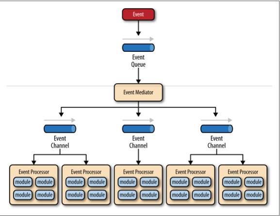

在事件驱动架构中拥有十几个，甚至几百个事件队列是很常见的情况，该模式并没有对事件队列的实现有明确的要求，这就意味着事件队列可以是消息队列，Web 服务端，或者其它类似的东西。

在事件驱动架构模式中主要有两种事件：初始事件和待处理事件。初始事件是中介所接收到的最原始的事件，没有经过其他组件的处理；而待处理事件是由事件中介生成，由事件处理器接收的组件，不能把待处理事件看作初始事件经过处理后得到的事件，两者是完全不同的概念。

事件中介负责分配、协调初始事件中的各个待执行步骤，事件中介需要为每一个初始事件中的步骤发送一个特定的待处理事件到事件通道中，触发事件处理器接收和处理该待处理事件。这里需要注意的是：事件 中介没有真正参与到对初始事件必须处理的业务逻辑的实现之中；相反，事件中介只是知道初始事件中有哪些步骤需要被处理。

事件中介通过事件通道将与初始事件每一个执行步骤相关联的特定待处理事件传递给事件处理器。尽管我们通常在待处理事件能被多个事件处理器处理时才会在中介拓扑结构中使用 消息主题，但事件通道仍可以是消息队列或 消息主题。（但需要注意的是，尽管在使用 消息主题 时待处理事件能被多个事件处理器处理，但由于接收到的待处理事件各异，所以对其处理的操作也各不相同）

为了能顺利处理待处理事件，事件处理器组件中包含了应用的业务逻辑。此外，事件处理器作为事件驱动架构中的组件，不依赖于其他组件，独立运作，高度解耦，在应用或系统中完成特定的任务。当事件处理器需要处理的事件从细粒度（例如：计算订单的营业税）变为粗粒度（例如：处理一项保险索赔事务），必须要注意的是：一般来说，每一个事件处理器组件都只完成一项唯一的业务工作，并且事件处理器在完成其特定的业务工作时不能依赖其他事件处理器。

虽然事件中介有许多方法可以实现，但作为一名架构工程师，你应该了解所有实现方式，以确保你能为你的实际需求选择了最合适的事件中介。

事件中介最简单、常见的实现就是使用开源框架，例如：Spring Integration，Apache Camel，或 Mule ESB。事件流在这些开源框架中通常用 Java 或 域特定语言（domain-specific language）。在调节过程和业务流程都很复杂的使用场景下，你可以使用业务流程执行语言（BPEL - business process execution language）结合类似开源框架 Apache ODE 的 BPEL 引擎进行开发。BPEL 是一种基于 XML 的服务编制编程语言，它为处理初始事件时需要描述的数据和步骤提供了描述。对每一个拥有复杂业务流程（包括与用户交互的执行步骤）的大型应用来说，你可以使用类似 jBPM 的业务处理管理系统（business process manager）实现事件中介。

如果你需要使用中介拓扑结构，那么理解你的需求，并为其匹配恰当的事件中介实现是构建事件驱动架构过程中至关重要的一环。使用开源框架去解决非常复杂的业务处理、管理、调节事件，注定会失败，因为开源框架只是用 BPM 的方式解决了一些简单的事件分发逻辑，比起你的业务逻辑，其中的事件分发逻辑简直是九牛一毛。

为了解释清楚中介拓扑结构是怎么运作的，我假设你在某家保险公司买了保险，成为了受保人，然后你打算搬家。在这种情况下，初始事件就是重定位事件，或者其他类似的事件。与重定位事件相关的处理步骤就像下图展示的那样，处于事件中介之中。对每一个初始事件的传入，事件中介都会创建一个待处理事件（例如：改变地址，重新计算保险报价，等等……），并将它发送给事件通道，等待发出响应的事件处理器处理待处理事件（例如：客户改变地址的操作流程、报价计算流程，等等……）。直到初始事件中的每一个需要处理的步骤完成了，这项处理才会继续（例如：把所有手续都完成之后，保险公司才会帮你改变地址）。事件中介中，重新报价和更新理赔步骤上面的直线表示这些步骤可以并行处理。

### 代理 (Broker) 拓扑结构

代理拓扑结构与中介拓扑结构不同之处在于：代理拓扑结构中没有核心的事件中介；相反，事件流在代理拓扑结构中通过一个轻量的消息代理（例如：ActiveMQ, HornetQ，等等……）将消息串联成链状，分发至事件处理器组件中进行处理。代理扑结构适用的使用场景大致上具有以下特征：你的事件处理流相对来说比较简单，而且你不想（不需要）使用核心的事件分配、调节机制以提高你处理事件的效率。

在代理拓扑结构中主要包括两种组件：代理和事件处理器。代理可被集中或相互关联在一起使用，此外，代理中还可以包含所有事件流中使用的事件通道。

存在于代理组件中的事件通道可以是消息队列，消息主题,或者是两者的组合。

代理拓扑结构大致如下图，如你所见，在这其中没有一个核心的事件中介组件控制和分发初始事件；相反，每一个事件处理器只负责处理一个事件，并向外发送一个事件，以标明其刚刚执行的动作。例如，假设存在一个事件处理器用于平衡证券交易，那么事件处理器可能会接受一个拆分股票的初始事件，为了处理这项初始事件，事件处理器则需要重新平衡股票的投资金额，而这个重新平衡的事件将由另一个事件处理器接收、处理。在这其中有一个细节需要注意：处理初始事件后，由事件处理器发出的事件不被其他事件处理器接收、处理的情况时常会发生，尤其是你在为应用添加功能和进行功能拓展时，这种情况更为常见。

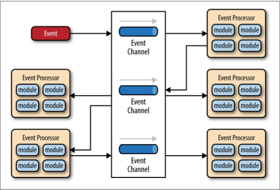

为了阐明代理拓扑结构的运行机制，我会用一个与讲解中介拓扑结构时类似的例子（受保人旅行的例子）进行解释。因为在代理拓扑结构中没有核心事件中介接收初始事件，那么事件将由客户处理组件直接接收，改变客户的地址，并发出一个事件告知系统客户的地址被其进行了改变（例如：改变地址的事件）。在这个例子中：有两个事件处理器会与改变地址的事件产生关联：报价处理和索赔处理。报价事件处理器将根据受保人的新地址重新计算保险的金额，并发出事件告知系统该受保人的保险金额被其改变。而索赔事件处理器将接受到相同的改变地址事件，不同的是，它将更新保险的赔偿金额，并发出一个更新索赔金额事件告知系统该受保人的赔偿金额被其改变。当这些新的事件被其他事件处理器接收、处理，使事件链一环扣一环地交由系统处理，直到事件链上的所有事件都被处理完，初始事件的处理才算完成。

    

如上图所示，代理拓扑结构的设计思想就是将对事件流的处理转换为对事件链的业务功能处理，把代理拓扑结构看作是接力比赛是最好的理解方式：在一场4*100的接力比赛中，每一位运动员都需要拿着一根接力棒跑100米，运动员跑完自己的100米后需要将接力棒传递给下一位运动员，直到最后一位运动员拿着接力棒跑过终点线，整场接力比赛才算结束。根据这样的逻辑我们还可以知道：在代理拓扑结构中，一旦某个事件处理器将事件传递给另一个事件处理器，那么这个事件处理器不会与该事件的后续处理产生任何联系。

### 顾虑

实现事件驱动架构模式相对于实现其他架构模式会更困难一些，因为它通过异步处理进行事件分发。当你需要在你的应用中使用这种架构模式，你必须处理各种由事件分发处理带来的问题，例如：远程操作功能的可用性，缺少权限，以及在代理或中介中处理事件失败时，用于处理这种情况的重连逻辑。如果你不能很好地解决这些问题，那你的应用一定会出现各种 Bug，让开发团队痛苦不已。

在选择事件驱动架构时还有一点需要注意：在处理单个业务逻辑时，这种架构模式不能处理细粒度的事务。因为事件处理器都高度解耦、并且广泛分布，这使得在这些事件处理器中维持一个业务单元变得非常困难。因此，当你使用这种架构模式架构你的应用时，你必须不断地考虑哪些事件能单独被处理，哪些不能，并为此设计相应事件处理器的处理粒度。如果你发现你需要将一个业务单元切割成许多子单元，并一一匹配相应的事件处理器，那你就要为此进行代码设计；如果你发现你用多个不同的事件处理器处理的哪些业务其实是可以合并到一个业务事件之中的，那么这种模式可能并不适合你的应用，又或者是你的设计出了问题。

使用事件驱动架构模式最困难的地方就在于架构的创建、维护、以及对事件处理器的管理。通常每一个事件都拥有其指定的事件处理协议（例如：传递给事件处理器的数据类型、数据格式），这就使得设下标准的数据格式成为使用事件驱动架构模式中至关重要的一环（例如：XML，JSON，Java 对象，等等……），并在架构创建之初就为这些数据格式授权，以便处理。

### 模式分析

下面是基于对常见的架构模式特征进行评价的标准，对事件驱动架构模式所作的实际分析，评价是以常见的架构模式的相似实现作为标准进行的，如果你想知道进行对比的其他架构模式对应的特征，可以结尾处查看  [附录A](#appendix) 的汇总表。 

#### 整体灵活性
评价：高        
分析：整体灵活性用于评价架构能否在不断改变的使用场景下快速响应，因为事件处理器组件使用目的单一、高度解耦、与其他事件处理器组件相互独立，不相关联，那么发生的改变对一个或多个事件处理器来说普遍都是独立的，使得对改变的反馈非常迅速，不需要依赖其他事件处理器的响应作出处理。

#### 易于部署
评价：高       
分析：总的来看，事件驱动架构模式由于其高度解耦的事件处理器组件的存在，对事件的部署相对来说比较容易，而使用代理拓扑结构比使用中介拓扑结构进行事件调度会更容易一些，主要是因为在 中介拓扑结构中事件处理器与事件中介紧密地耦合在一起：事件处理器中发生改变后，事件中介也随之改变，如果我们需要改变某个被处理的事件，那么我们需要同时调度事件处理器和事件中介。

#### 可测试性
评价：低       
分析：虽然在事件驱动架构模式中进行单元测试并不困难，但如果我们要进行单元测试，我们就需要某种特定的测试客户端或者是测试工具产生事件，为单元测试提供初始值。此外，由于事件驱动架构模式是异步进行事件分发的，其异步处理的特性也为单元测试带来了一定的困难。

#### Performance 性能
评价：高       
分析：对消息传递的架构可能会让设计出来的事件驱动架构的表现不如我们的期望，但通常来说，该模式都能通过其异步处理的特性展示优秀的性能表现；换句话来说，高度解耦，异步并行操作大大减少了传递消息过程中带来的时间开销。

#### 伸缩性
评价：高       
分析：事件驱动架构中的高度解耦、相互独立的事件处理器组件的存在，使得可拓展性成为该架构与生俱来的优点。架构的这些特定使得事件处理器能够进行细粒度的拓展，使得每一个事件处理器都能单独被拓展，而不影响其他事件处理器。

#### 易于开发
评价：低     
分析：由于使用事件驱动架构进行开发需要考虑其异步处理机制、协议创建流程，并且开发者需要用代码为事件处理器和操作失败的代理提供优秀的错误控制环境，无疑使得用事件驱动架构进行开发会比使用其他架构进行开发要困难一些。

### 译者注

读完整篇文章，我相信大家对 mediator 与 broker 这两个概念有一个大致的印象，但就两者的译文来看，中介和代理似乎没什么区别，尤其是了解 proxy 的读者会更加困惑，这三者之间到底是什么关系？它们的概念是互通的吗？为了解决这种混淆，译者将在此阐述三者间的区别：

假如现在我有一个事件/事件流需要被处理，那么使用 mediator、broker、proxy 处理事件的区别在哪里呢？

- 如果我们使用 mediator，那就意味着我将把事件流交给 mediator，mediator 会帮我把事件分解为多个步骤，并分析其中的执行逻辑，调整和分发事件（例如判断哪些事件可以并行，哪些事件可以串行），然后根据 mediator 分解、调节的结果去执行事件中的每一个步骤，把所有步骤完成后，就能把需要处理的事件处理好。

- 如果我们使用 broker，那就意味着我将把事件交给 broker，broker 获得事件后会把事件发出去（在本文中为：通知架构中所有可用的事件处理器），事件处理器们接收到事件以后，判断处理这个事件是否为自己的职责之一，如果不是则无视，与自己有关则把需要完成的工作完成，完成后如果事件还有后续需要处理的事件，则通过 broker 再次发布，再由相关的事件处理器接收、处理。以这样的方式将事件不断分解，沿着事件链一级一级地向下处理子事件，直到事件链中的所有事件被完成，我的事件也就处理好了。

- 如果我们使用 proxy，那就意味着我自己对需要处理的事件进行了分解，然后把不同的子事件一一委托给不同的 proxy，由被委托的 proxy 帮我完成子事件，从而完成我要做的事件。

<b id="chapter3"></b>
## 第三章 微内核架构

微内核架构模式(也称为插件化应用架构)对于基于产品的应用程序来说是一个很自然的选择。基于产品的应用是指一个经过打包的、可以通过版本下载的一个典型的第三方产品。然而，很多公司也会开发和发布他们的内部商业软件，完整的版本号、发布日志和可插拔的新特性，这些就非常符合微内核架构的思想。微内核架构模式可以通过插件的形式添加额外的特性到核心系统中，这提供了很好的扩展性，也使得新特性与核心系统隔离开来。( 译者注: 比如，著名的Eclipse IDE就是基于插件化开发的，eclipse核心更像是一个微内核，或者我们可把它叫做开放平台，其他的功能通过安装插件的形式添加到eclipse中。 )

### 模式描述

微内核架构主要需要考虑两个方面: 核心系统和插件模块。应用逻辑被划分为独立的插件模块和核心系统，这样就提供良好的可扩展性、灵活性，应用的新特性和自定义处理逻辑也会被隔离。图3-1演示了基本的微内核架构。

微内核架构的核心系统一般情况下只包含一个能够使系统运作起来的最小化模块。很多操作系统的实现就是使用微内核架构，因此这也是该架构名字的由来。从商业应用的角度看，核心系统通常是为特定的使用场景、规则、或者复杂条件处理定义了通用的业务逻辑，而插件模块根据这些规则实现了具体的业务逻辑。

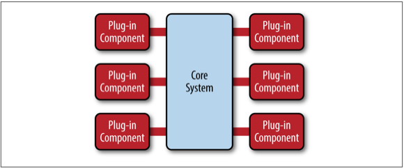

插件模块是一个包含专业处理、额外特性的独立组件，自定义代码意味着增加或者扩展核心系统以达到产生附加的业务逻辑的能力。通常，插件模块之间应该是没有任何依赖性的，但是你也可以设计一个需要依赖另一个插件的插件。但无论如何，使得插件之间可以通信的同时避免插件之间产生依赖又是一个特别重要的问题。

核心系统需要了解插件模块的可用性以及如何获取到它们。一个通用的实现方法是通过一组插件注册表。这个插件注册表含有每个插件模块的信息，包括它的名字、数据规约和远程访问协议(取决于插件如何与核心系统建立连接)。例如，一个税务软件的用于标识高风险的税务审计插件可能会有一个含有插件名(比如AuditChecker)的注册入口，数据规约(输入数据、输出数据)和规约格式( 比如xml )。如果这个插件是通过SOAP服务访问，那么它可能会包含一个WSDL (Web Services Definition Language).

插件模块可以通过多种方式连接到核心系统，包括OSGi ( open service gateway initiative )、消息机制、web服务或者直接点对点的绑定 ( 比如对象实例化，即依赖注入 )。你使用的连接类型取决于你构建的应用类型和你的特殊需求（比如单机部署还是分布式部署）。微内核架构本身没有指定任何的实现方式，唯一的规定就是插件模块之间不要产生依赖。

插件和核心系统的通信规范包含标准规范和自定义规范。自定义规范典型的使用场景是插件组件是被第三方构建的。在这种情况下，通常是在第三方插件规约和你的标准规范创建一个Adapter来使核心系统根本不需要知道每个插件的具体细节。当创建标准规范 ( 通常是通过XML或者Java Map )时，从一开始就创建一个版本策略是非常重要的。 

### 架构示例

也许微内核架构的最好示例就是大家熟知的Eclipse IDE了。下载最基本的Eclipse后，它只能提供一个编辑器。然后，一旦你开始添加插件，它就变成一个高度可定制化和非常有用的产品（译者注 : 更多内容大家可以参考 [开源软件架构 卷1：第6章 Eclipse之一](http://www.ituring.com.cn/article/6817) ）。浏览器是另一个使用微内核架构的产品示例，它由一个查看器和其他扩展的插件组成。

基于微内核架构的示例数不胜数，但是大型的商业应用呢？微内核应用架构也适用于这些情形。为了阐述这个观点，让我们来看看另一个保险公司的示例，但是这次的示例会涉及保险赔偿处理。  

赔偿处理是一个非常复杂的过程。每个州都有不同的关于保险赔偿的规则和条文。例如一些州允许在你的挡风玻璃被石头砸碎时免费进行替换，但是一些州则不是这样。因为大家的标准都不一样，因此赔偿标准几乎可以是无限的。

有很多保险赔偿应用运用大型和复杂的规则处理引擎来处理不同规则带来的复杂性。然而，可能会因为某条规则的改变而引起其他规则的改变而使得这些规则处理引擎变成一个大泥球，或者使简单需求变更会需要一个很大的分析师、工程师、测试工程师来进行处理。使用微内核架构能够很好的解决这个问题，核心系统只知道根据赔偿规则处理，但这个赔偿规则是抽象的，系统将赔偿规则作为一个插件规范，具体的规则有对应的实现，然后注入到系统中即可。

图3-2中的一堆文件夹代表了赔偿处理核心系统。它包含一些处理保险赔偿的基本业务逻辑。每一个插件模块包含每个州的具体赔偿规则。在这个例子中，插件模块通过自定义源代码实现或者分离规则引起实例。不管具体实现如何，关键就在于赔偿规则和处理都从核心系统中分离，而这些规则和处理过程都可以被动态地添加、移除，而这些改变对于核心系统和其他插件只有很小的影响或者根本不产生影响。

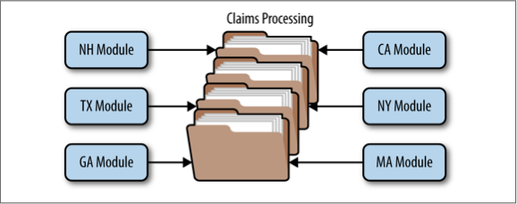

### 注意事项

对于微内核架构来说一个很重要的一点就是它能够被嵌入或者说作为另一种架构的一部分。例如，如果这个架构解决的是一个你应用中易变领域的特定的问题 ( 译者注 : 即插件化能够解决你应用中的某个特定模块的架构问题 )，你可能会发现你不能在整个应用中使用这种架构。在这种情况下，你可以将微内核架构嵌入到另一个架构模式中 ( 比如分层架构 )。同样的，在上一章节中描述的事件驱动架构中的事件处理器组件也可以使用微内核架构。

微内核架构对渐进式设计和增量开发提供了非常好的支持。你可以先构建一个单纯的核心系统，随着应用的演进，系统会逐渐添加越来越多的特性和功能，而这并不会引起核心系统的重大变化。

对基于产品的应用来说，微内核架构应该是你的第一选择。特别是那些你会在后续开发中发布附加特性和控制哪些用户能够获取哪些特性的应用。如果你在后续开发中发现这个架构不能满足你的需求了，你能够根据你的特殊需求将你的应用重构为另一个更好的架构。

### 模式分析

下面的表格中包含了微内核架构每个特性的评级和分析。以微内核架构的最经典的实现方式的自然趋势为依据对每个特性进行评级。关于微内核架构与其他模式的相关性比较请参考附录A。

#### 整体灵活性
评级 : 高     
分析 : 整体灵活性是指能够快速适应不断变化的环境的能力。通过插件模块的松耦合实现，可以将变化隔离起来，并且快速满足需求。通常，微内核架构的核心系统很快趋于稳定，这样系统就变得很健壮，随着时间的推移它也不会发生多大改变。

#### 易于部署
评级 : 高       
分析 : 根据实现方式，插件模块能够在运行时被动态地添加到核心系统中 （ 比如，热部署 ）,把停机时间减到最小。

#### 可测试性
评级 : 高           
分析 : 插件模块能够被独立的测试，能够非常简单地被核心系统模拟出来进行演示，或者在对核心系统很小影响甚至没有影响的情况下对一个特定的特性进行原型展示。

#### 性能
评级 : 高          
分析 : 使用微内核架构不会自然而然地使你的应用变得高性能。通常，很多使用微内核架构的应用运行得很好，因为你能定制和简化应用程序，使它只包含那些你需要的功能模块。JBoss应用服务器就是这方面的优秀示例: 依赖于它的插件化架构，你可以只加载你需要的功能模块，移除那些消耗资源但没有使用的功能特性，比如远程访问，消息传递，消耗内存、CPU的缓存，以及线程，从而减小应用服务器的资源消耗。

#### 伸缩性
评级 : 低          
分析 : 因为微内核架构的实现是基于产品的，它通常都比较小。它们以独立单元的形式实现，因此没有太高的伸缩性。此时，伸缩性就取决于你的插件模块，有时你可以在插件级别上提供可伸缩性，但是总的来说这个架构并不是以构建高度伸缩性的应用而著称的。

#### 易于开发
评级 : 低      
分析 : 微内核架构需要考虑设计和规约管理，使它不会很难实现。规约的版本控制，内部的插件注册，插件粒度，丰富的插件连接的方式等是涉及到这个架构模式实现复杂度的重要因素。

<b id="chapter4"></b>
## 第四章 微服务架构

微服务架构模式作为替代单体应用和面向服务架构的一个可行的选择，在业内迅速取得进展。由于这个架构模式仍然在不断的发展中，在业界存在很多困惑——这种模式是关于什么的？它是如何实现的？本报告的这部分将为你提供关键概念和必要的基础知识来理解这一重要架构模式的好处(和取舍)，以此来判断这种架构是否适合你的应用。

### 模式描述

不管你选择哪种拓扑或实现风格,有几种常见的核心概念适用于一般架构模式。第一个概念是*单独部署单元*。如图4-1所示，微服务架构的每个组件都作为一个独立单元进行部署，让每个单元可以通过有效、简化的传输管道进行通信，同时它还有很强的扩展性，应用和组件之间高度解耦，使得部署更为简单。

也许要理解这种模式，最重要的概念就是服务组件（service component）。不要考虑微服务架构内部的服务，而最好是考虑服务组件，从粒度上讲它可以小到单一的模块，或者大至一个应用程序。服务组件包含一个或多个模块（如Java类），这些模块可以提供一个单一功能（如，为特定的城市或城镇提供天气情况），或也可以作为一个大型商业应用的一个独立部分（如，股票交易布局或测定汽车保险的费率）。在微服务架构中，正确设计服务组件的粒度是一个很大的挑战。在接下来的服务组件部分对这一挑战进行了详细的讨论。

     

微服务架构模式的另一个关键概念是它是一个*分布式*的架构，这意味着架构内部的所有组件之间是完全解耦的，并通过某种远程访问协议（如， JMS, AMQP, REST, SOAP, RMI等）进行访问。这种架构的分布式特性是它实现一些优越的可扩展性和部署特性的关键所在。

微服务架构另一个令人兴奋的特性是它是由其他常见架构模式存在的问题演化来的，而不是作为一个解决方案被创造出来等待问题出现。微服务架构的演化有两个主要来源：使用分层架构模式的单体应用和使用面向服务架构的分布式应用。

由单体应用( 一个应用就是一个整体 )到微服务的发展过程主要是由持续交付开发促成的。从开发到生产的持续部署管道概念,简化了应用程序的部署。单体应用通常是由紧耦合的组件组成，这些组件同时又是另一个单一可部署单元的一部分，这使得它繁琐，难以改变、测试和部署应用（因此常见的“月度部署”周期出现并通常发生在大型IT商店项目）。这些因素通常会导致应用变得脆弱以至于每次有一点新功能部署后应用就不能运行。微服务架构模式通过将应用分隔成多个可部署的单元（服务组件）的方法来解决这一问题，这些服务组件可以独立于其他服务组件进行单独开发、测试和部署。

另一个导致微服务架构模式产生的演化过程是由面向服务架构模式（SOA）应用程序存在的问题引起的。虽然SOA模式非常强大，提供了无与伦比的抽象级别、异构连接、服务编排，并保证通过IT能力调整业务目标，但它仍然是复杂的,昂贵的,普遍存在，它很难理解和实现，对大多数应用程序来说过犹不及。微服务架构通过简化服务概念，消除编排需求、简化服务组件连接和访问来解决复杂度问题。

### 模式拓扑

虽然有很多方法来实现微服务架构模式,但三个主要的拓扑结构脱颖而出，最常见和流行的有:基于REST API的拓扑结构,基于REST的应用拓扑结构和集中式消息拓扑结构。

基于REST的API拓扑适用于网站，通过某些API对外提供小型的、自包含的服务。这种拓扑结构,如图4 - 2所示,由粒度非常细的服务组件（因此得名微服务）组成，这些服务组件包含一个或两个模块并独立于其他服务来执行特定业务功能。在这种拓结构扑中,这些细粒度的服务组件通常被REST-based的接口访问，而这个接口是通过一个单独部署的web API层实现的。此种拓扑的例子包含一些常见的专用的、基于云的RESTful web service，大型网站像Yahoo, Google, and Amazon都在使用。

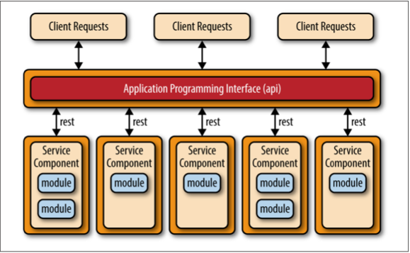    

基于REST的应用拓扑结构与基于REST API的不同，它通过传统的基于web的或胖客户端业务应用来接收客户端请求，而不是通过一个简单的API层。如图4-3所示，应用的用户接口层（user interface layer）是一个web应用，可以通过简单的REST-based接口访问单独部署的服务组件（业务功能）。该拓扑结构中的服务组件与API-REST-based拓扑结构中的不同，这些服务组件往往会更大、粒度更粗、代表整个业务应用程序的一小部分，而不是细粒度的、单一操作的服务。这种拓扑结构常见于中小型企业等复程度相对较低的应用程序。

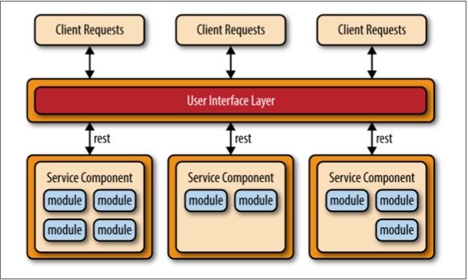    

微服务架构模式中另一个常见的方法是集中式消息拓扑。该拓扑（如图4-4所示）与前面提到的基于REST的应用拓扑类似，不同的是，application REST- based拓扑结构使用REST进行远程访问，而该拓扑结构则使用一个轻量级的集中式消息代理（如，ActiveMQ, HornetQ等等）。不要将该拓扑与面向服务架构模式混淆或将其当做SOA简化版（“SOA-Lite”），这点是极其重要的。该拓扑中的轻量级消息代理（Lightweight Message Broker）不执行任何编排,转换,或复杂的路由;相反,它只是一个轻量级访问远程服务组件的传输工具。

集中式消息拓扑结构通常应用在较大的业务应用程序中，或对于某些对传输层到用户接口层或者到服务组件层有较复杂的控制逻辑的应用程序中。该拓扑较之先前讨论的简单基于REST的拓扑结构，其好处是有先进的排队机制、异步消息传递、监控、错误处理和更好的负载均衡和可扩展性。与集中式代理相关的单点故障和架构瓶颈问题已通过代理集群和代理联盟（将一个代理实例为分多个代理实例，把基于系统功能区域的吞吐量负载划分开处理）解决。

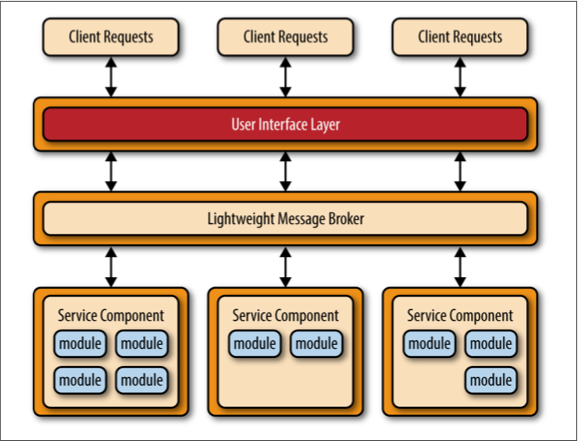   

### 避免依赖和编排

微服务架构模式的主要挑战之一就是决定服务组件的粒度级别。如果服务组件粒度过粗，那你可能不会意识到这个架构模式带来的好处（部署、可扩展性、可测试性和松耦合），然而,服务组件粒度过细将导致服务编制要求,这会很快导致将微服务架构模式变成一个复杂、容易混淆、代价昂贵并易于出错的重量级面向服务架构。

如果你发现需要从应用内部的用户接口或API层编排服务组件，那么很有可能你服务组件的粒度太细了。如果你发现你需要在服务组件之间执行服务间通信来处理单个请求,那么很有可能要么是你服务组件的粒度太细了，要么是没有从业务功能角度正确划分服务组件。

服务间通信，可能导致组件之间产生耦合，但可以通过共享数据库进行处理。例如，若一个服务组件处理网络订单而需要用户信息时，它可以去数据库检索必要的数据，而不是调用客户服务组件的功能。

共享数据库可以处理信息需求，但是共享功能呢？如果一个服务组件需要的功能包含在另一个服务组件内，或是一个公共的功能,那么有时你可以将服务组件的共享功能复制一份（因此违反了DRY规则：don’t repeat yourself）。为了保持服务组件独立和部署分离，微服务架构模式实现中会存在一小部分由重复的业务逻辑而造成的冗余，这在大多数业务应用程序中是一个相当常见的问题。小工具类可能属于这一类重复的代码。

如果你发现就算不考虑服务组件粒度的级别，你仍不能避免服务组件编排,这是一个好迹象,可能此架构模式不适用于你的应用。由于这种模式的分布式特性，很难维护服务组件之间的单一工作事务单元。这种做法需要某种事务补偿框架回滚事务,这对此相对简单而优雅的架构模式来说，显著增加了复杂性。

### 注意事项

微服务架构模式解决了很多单体应用和面向服务架构应用存在的问题。由于主要应用组件被分成更小的,单独部署单元,使用微服务架构模式构建的应用程序通常更健壮,并提供更好的可扩展性,支持持续交付也更容易。

该模式的另一个优点是,它提供了实时生产部署能力，从而大大减少了传统的月度或周末“大爆炸”生产部署的需求。因为变化通常被隔离成特定的服务组件，只有变化的服务组件才需要部署。如果你的服务组件只有一个实例，你可以在用户界面程序编写专门的代码用于检测一个活跃的热部署,一旦检测到就将用户重定向到一个错误页面或等待页面。你也可以在实时部署期间，将服务组件的多个实例进行交换，允许应用程序在部署期间保持持续可用性（分层架构模式很难做到这点）。

最后一个要重视的考虑是，由于微服务架构模式是分布式的架构，他与事件驱动架构模式具有一些共同的复杂的问题，包括约定的创建、维护，和管理，远程系统的可用性，远程访问身份验证和授权。

### 模式分析

下面这个表中包含了微服务架构模式的特点分析和评级，每个特性的评级是基于自然趋势，基于典型模式实现的能力特性,以及该模式是以什么闻名的。本报告中该模式与其他模式的并排比较，请参考报告最后的附件A。

#### 整体灵活性
评级：高      
分析：整体的灵活性是能够快速响应不断变化的环境。由于单独部署单元的概念,变化通常被隔离成单独的服务组件,使得部署变得快而简单。同时，使用这种模式构建的应用往往是松耦合的，也有助于促进改变。

#### 易于部署
评级：高      
分析：整体来讲，由于该模式的解耦特性和事件处理组件使得部署变得相对简单。broker拓扑往往比mediator拓扑更易于部署，主要是因为event-mediator组件与事件处理器是紧耦合的，事件处理器组件有一个变化可能导致event mediator跟着变化，有任何变化两者都需要部署。

#### 可测试性
评级：高      
分析：由于业务功能被分离成独立的应用模块,可以在局部范围内进行测试，这样测试工作就更有针对性。对一个特定的服务组件进行回归测试比对整个单体应用程序进行回归测试更简单、更可行。而且,由于这种模式的服务组件是松散耦合的，从开发角度来看，由一个变化导致应用其他部分也跟着变化的几率很小，并能减小由于一个微小的变化而不得不对整个应用程序进行测试的负担。

#### 性能
评级：低      
分析：虽然你可以从实现该模式来创建应用程序并可以很好的运行，整体来说，由于微服务架构模式的分布式特性，并不适用于高性能的应用程序。

#### 伸缩性
评级：高      
分析：由于应用程序被分为单独的部署单元,每个服务组件可以单独扩展，并允许对应用程序进行扩展调整。例如，股票交易的管理员功能区域可能不需要扩展，因为使用该功能的用户很少，但是交易布局服务组件可能需要扩展，因为大多数交易应用程序需要具备处理高吞吐量的功能。

#### 易于开发
评级：高      
分析：由于功能被分隔成不同的服务组件，由于开发范围更小且被隔离，开发变得更简单。程序员在一个服务组件做出一个变化影响其他服务组件的几率是很小的，从而减少开发人员或开发团队之间的协调。

<b id="chapter5"></b>
## 第五章 基于空间的架构

大多数基于网站的商务应用都遵循相同的请求流程：一个请求从浏览器发到web服务器，然后到应用服务器，然后到数据库服务器。虽然这个模式在用户数不大的时候工作良好，但随着用户负载的增加,瓶颈会开始出现，首先出现在web服务器层，然后应用服务器层，最后数据库服务器层。通常的解决办法就是**向外扩展**，也就是增加服务器数量。这个方法相对来说简单和廉价，并能够解决问题。然而，对于大多数高访问量的情况，它只不过是把web服务器的问题移到了应用服务器。而扩展应用服务器会更复杂，而且成本更高，并且又只是把问题移动到了数据库服务器，那会更复杂，更贵。就算你能扩展数据库服务器，你最终会陷入一个金字塔式的情形，在金字塔最下面是web服务器，它会出现最多的问题，但也最好伸缩。金字塔顶部是数据库服务器，问题不多，但最难伸缩。

在一个高并发大容量的应用中，数据库通常是决定应用能够支持多少用户同时在线的关键因素。虽然各种缓存技术和数据库伸缩产品都在帮助解决这个问题，但数据库难以伸缩的现实并没有改变。

基于空间的架构模型是专门为了**解决伸缩性和并发问题**而设计的。它对于用户数量不可预测且数量级经常变化的情况同样适用。在架构级别来解决这个伸缩性问题通常是比增加服务器数量或者提高缓存技术更好的解决办法。

### 模型介绍

基于空间的模型（有时也称为云架构模型）旨在减少限制应用伸缩的因素。模型的名字来源于分布式共享内存中的 tuple space（数组空间）概念。高伸缩性是通过去除中心数据库的限制，并使用从内存中复制的数据框架来获得的。保存在内存的应用数据被复制给所有运行的进程。进程可以动态的随着用户数量增减而启动或结束，以此来解决伸缩性问题。这样因为没有了中心数据库，数据库瓶颈就此解决，此后可以近乎无限制的扩展了。

大多数使用这个模型的应用都是标准的网站，它们接受来自浏览器的请求并进行相关操作。竞价拍卖网站是一个很好的例子 ( 12306更是一个典型的示例 )。网站不停的接受来自浏览器的报价。应用收到对某一商品的报价，记录下报价和时间，并且更新对该商品的报价，将信息返回给浏览器。

这个架构中有两个主要的模块：**处理单元** 和 **虚拟化中间件**。下图展示了这个架构和里面的主要模块。

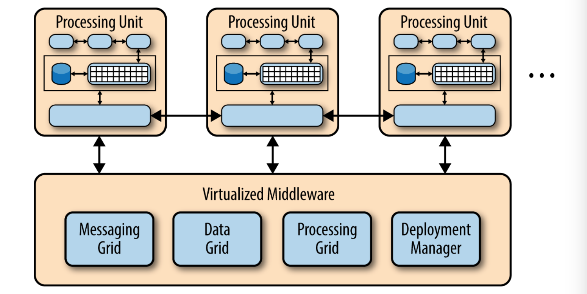

处理单元包含了应用模块（或者部分的应用模块）。具体来说就是包含了web组件以及后台业务逻辑。处理单元的内容根据应用的类型而异——小型的web应用可能会部署到单一的处理单元，而大型一些的应用会将应用的不同功能模块部署到不同的处理单元中。典型的处理单元包括应用模块，以及保存在内存的数据框架和为应用失败时准备的异步数据持久化模块。它还包括复制引擎，使得虚拟化中间件可以将处理单元修改的数据复制到其他活动的处理单元。

虚拟化中间件负责保护自身以及通信。它包含用于数据同步和处理请求的模块，以及通信框架，数据框架，处理框架和部署管理器。这些在下文中即将介绍的部分，可以自定义编写或者购买第三方产品来实现。

### 组件间合作

基于空间的架构的魔力就在虚拟化中间件，以及各个处理单元中的内存中数据框架。下图展示了包含着应用模块、内存中数据框架、处理异步数据恢复的组件和复制引擎的处理单元架构。

虚拟化中间件本质上是架构的控制器，它管理请求，会话，数据复制，分布式的请求处理和处理单元的部署。虚拟化中间件有四个架构组件：通信框架，数据框架，处理框架和部署管理器。

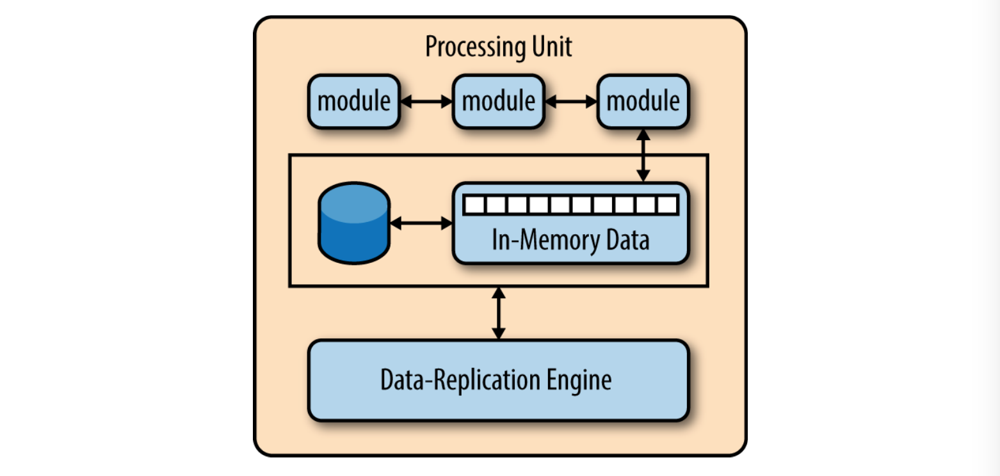

#### 通信框架

通信框架管理输入请求和会话信息。当有请求进入虚拟化中间件，通信框架就决定有哪个处理单元可用，并将请求传递给这个处理单元。通信框架的复杂程度可以从简单的round robin算法到更复杂的用于监控哪个请求正在被哪个处理单元处理的next-available算法。

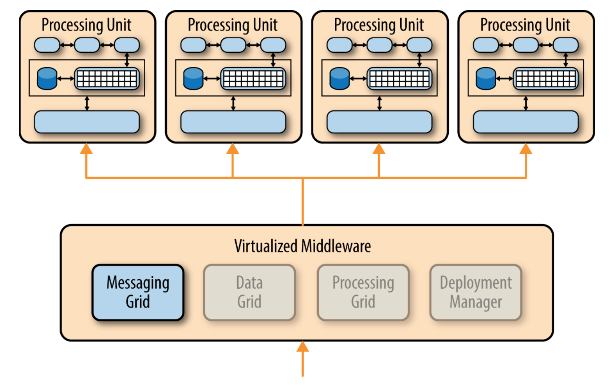

#### 数据框架

数据框架可能是这个架构中最重要和关键的组件。它与各个处理单元的数据复制引擎交互，在数据更新时来管理数据复制功能。由于通信框架可以将请求传递给任何可用的处理单元，所以每个处理单元包含完全一样的内存中数据就很关键。下图展示处理单元间如何同步数据复制，实际中是通过非常迅速的并行的异步复制来完成的，通常在微秒级。

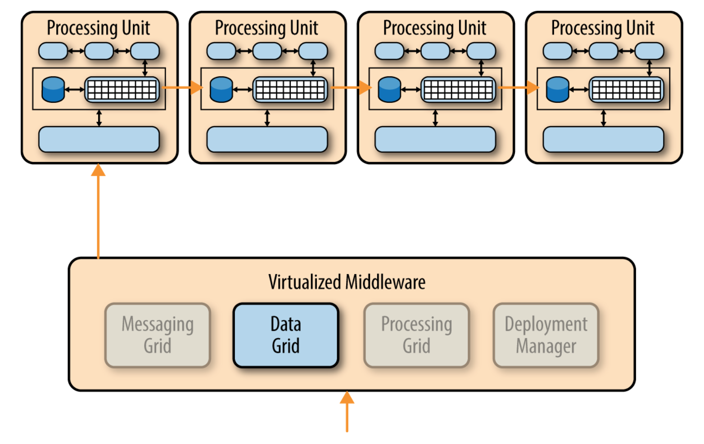

#### 处理框架

处理框架，就像下图所示，是虚拟化中间件中一个可选组件，负责管理在有多个处理单元时的分布式请求处理，每个处理单元可能只负责应用中的某个特定功能。如果请求需要处理单元间合作（比如，一个订单处理单元和顾客处理单元），此时处理框架就充当处理单元见数据传递的媒介。

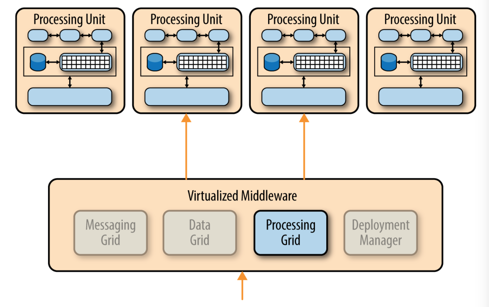

#### 部署管理器

部署管理器根据负载情况管理处理单元的动态启动和关闭。它持续检测请求所需时间和在线用户量，在负载增加时启动新的处理单元，在负载下降时关闭处理单元。它是实现可变伸缩性需求的关键。

### 其他考虑

基于空间的架构是一个复杂和实现起来相对昂贵的框架。对于有可变伸缩性需求的小型web应用是很好的选择，然而，对于拥有大量数据操作的传统大规模关系型数据库应用，并不那么适用。

虽然基于空间的架构模型不需要集中式的数据储存，但通常还是需要这样一个，来进行初始化内存中数据框架，和异步的更新各处理单元的数据。通常也会创建一个单独的分区，来从隔离常用的断电就消失的数据和不常用的数据，这样减少处理单元之间对对方内存数据的依赖。

值得注意的是，虽然这个架构的另一个名字是云架构，处理单元（以及虚拟化中间件）都没有放在云端服务或者PaaS上。他们同样可以简单的放在本地服务器，这也是为什么我更倾向叫它“基于空间的架构”。

从产品实现的角度讲，这个架构中的很多组件都可以从第三方获得，比如GemFire, JavaSpaces, GigaSpaces，IBM Object Grid，nCache，和 Oracle Coherence。由于架构的实现根据工程的预算和需求而异，所以作为架构师，你应该在实现或选购第三方产品前首先明确你的目标和需求。

### 架构分析

下面的表格是这个架构的特征分析和评分。每个特征的评分是基于一个典型的架构实现来给出的。要知道这个模式相对别的模式的对比，请参见最后的附录A。

#### 综合能力
评分：高       
分析：综合能力是对环境变化做出快速反应的能力。因为处理单元（应用的部署实例）可以快速的启动和关闭，整个应用可以根据用户量和负载做出反应。使用这个架构通常在应对代码变化上，由于较小的应用规模和组件间相互依赖，也会反映良好。

#### 易于部署
评分：高      
分析：虽然基于空间的架构通常没有解耦合并且功能分布，但他们是动态的，也是成熟的基于云的工具，允许应用轻松的部署到服务器。

#### 可测试性
评分：低      
分析：测试高用户负载既昂贵又耗时，所以在测试架构的可伸缩性方面很困难

#### 性能
评分：高      
分析：通过内存中数据存取和架构中的缓存机制可获得高性能

#### 伸缩性
评分：高     
分析：高伸缩性是源于几乎不依赖集中式的数据库，从而去除了这个限制伸缩性的瓶颈。

#### 易于开发
评分：低      
分析：主要是因为难以熟悉这个架构开发所需得工具和第三方产品，因此使用该架构需要较大的学习成本。而且，开发过程中还需要特别注意不要影响到性能和可伸缩性。

<b id="appendix" ></b>
### 附录A 
#### 模式分析总结
图A-1 总结了在这个报告中，对于架构模式的每部分进行的模式分析所产生的影响。这个总结帮助你确定哪些模式可能是最适合你的情况。例如,如果你的架构模式重点是可伸缩性，你可以在这个图表看看事件驱动模式,microservices模式,和基于空间模式，这些对于你来说可能是很好的架构模式的选择。同样的,如果你的程序注重的是分层架构模式,你可以参考图看到部署、性能和可伸缩性的在你的架构中所存在的风险。

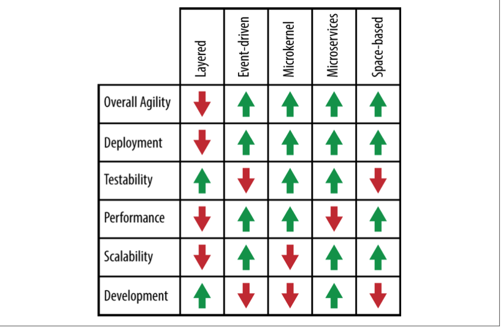     

同时这个图表将指导你选择正确的模式,因为在选择一种架构模式的时候，有更多的因素需要考虑。你必须分析你的环境的各个方面,包括基础设施的支持,开发人员技能,项目预算,项目最后期限,和应用程序大小等等。选择正确的架构模式是至关重要的,因为一旦一个架构被确定就很难改变。

<b id="author" ></b>
### 关于作者 
Mark•Richards是一位有丰富经验的软件架构师，他参与架构、设计和实施microservices体系结构、面向服务的体系结构和在J2EE中的分布式系统和其他技术。自1983年以来，他一直从事软件行业,在应用、继承和企业架构方面有大量的经验和专业知识。

Mark在1999到2003年间担任新英格兰Java用户组的主席。他是许多技术书籍和视频的作者,包括软件架构基础(O‘Reilly视频)、企业消息传递(O'Reilly视频),《Java消息服务，第二版》(O'Reilly)和《软件架构师应该知道的97件事》(O'Reilly)的特约作者。Mark拥有一个计算机科学硕士学位并且多次获得IBM、Sun、开放集团和BEA等颁发的架构师和开发人员认证。 

他是Fluff Just Stuff(NFJS)研讨会系列（一个不定期会议）议长,并且有过上百次的在世界各地公益会议和用户组上围绕技术主题的演讲经验)。Mark不工作的时候经常会到白色山脉或阿帕拉契山径徒步旅行。

